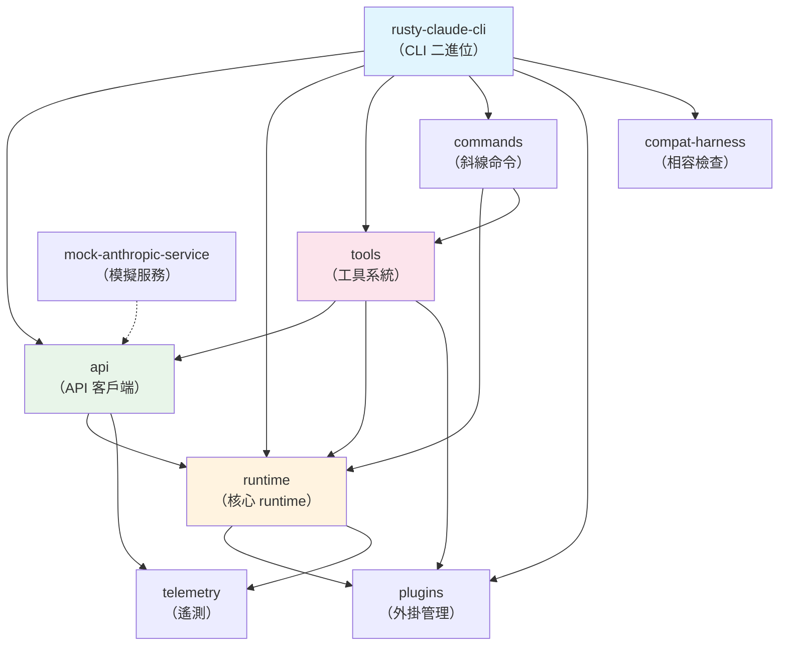
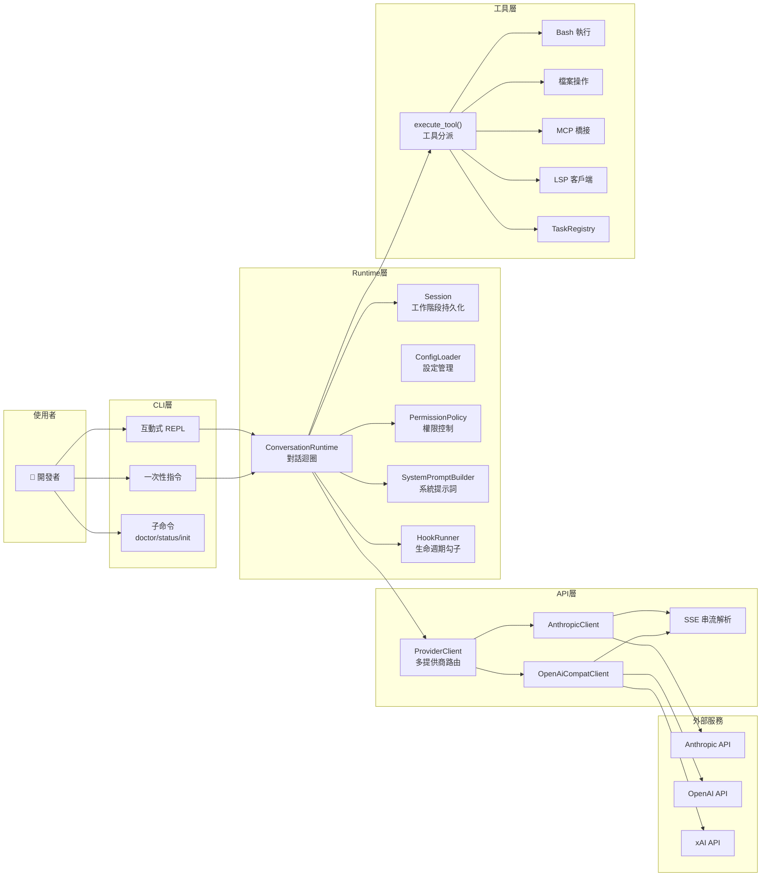
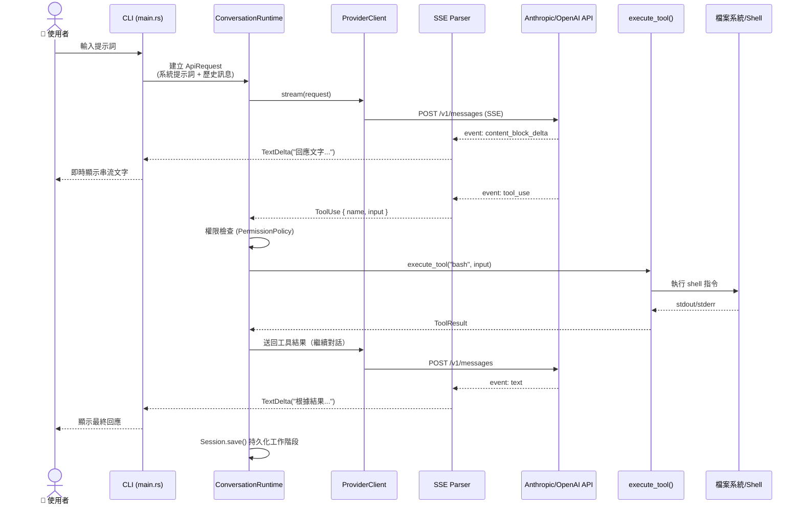
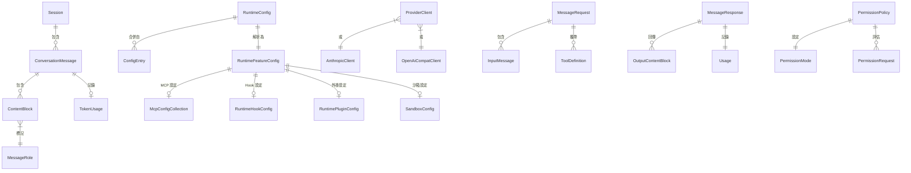
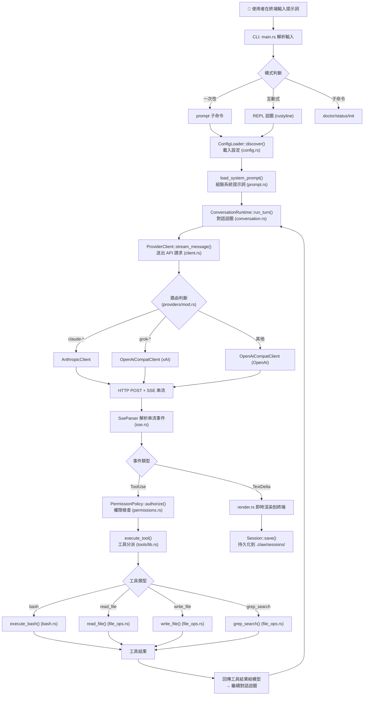

# Claw Code 完整專案教學文件

> 本教學文件旨在幫助一位**沒接觸過這個專案的開發者**在最短時間內理解專案並開始貢獻。

---

## 1. 專案概覽

### 這個專案是什麼？解決什麼問題？

Claw Code 是一個用 Rust 實作的 **CLI 代理人（agent）工具框架**，提供名為 `claw` 的命令列工具。它是 Claude Code 的開源 Rust 重寫版本，讓開發者可以透過終端機與 AI 模型（主要是 Anthropic Claude、但也支援 OpenAI 相容及 xAI）進行互動式對話，並讓 AI 直接在本地執行工具操作（如讀寫檔案、執行 bash 指令、搜尋程式碼等）。

**核心要解決的問題：**
- 提供一個高效能、安全的 AI 編程助手 CLI
- 支援多個 AI 提供商（Anthropic、OpenAI、xAI、DashScope）
- 透過工具系統讓 AI 能直接操作開發環境
- 展示「自主軟體開發」的哲學——人類提供方向，AI 代理人執行工作

### 目標用戶/使用場景

- **軟體開發者**：透過 CLI 與 AI 助手互動進行編碼、除錯、程式碼審查
- **DevOps 工程師**：利用 AI 輔助自動化腳本編寫與系統管理
- **團隊協作**：透過 MCP（Model Context Protocol）整合外部工具與服務
- **AI Agent 研究者**：研究自主軟體開發的工作流程與協調機制

### 專案目前的狀態

- **成熟度**：早期開發階段（v0.1.0），但核心功能已完整
- **活躍度**：積極開發中，截至最近已有 ~290+ commits、9 個 crate、~20K 行 Rust 程式碼
- **授權**：MIT
- **注意**：這是「僅限從原始碼建構」的專案，**不可**從 crates.io 安裝

---

## 2. 技術棧

### 語言、框架、主要依賴

| 類別 | 技術 | 說明 |
|------|------|------|
| 主要語言 | **Rust** (Edition 2021) | 高效能、記憶體安全 |
| 非同步執行 | **Tokio** | 非同步 runtime，用於 HTTP 串流與子程序管理 |
| HTTP 客戶端 | **reqwest** | 支援 SSE 串流、TLS、代理 |
| CLI 互動 | **rustyline** | REPL 介面、tab 補全、歷史紀錄 |
| 終端渲染 | **crossterm** + **pulldown-cmark** + **syntect** | 彩色輸出、Markdown 渲染、語法高亮 |
| 序列化 | **serde** + **serde_json** | JSON 處理 |
| 檔案搜尋 | **glob** + **regex** + **walkdir** | 檔案系統操作 |
| 加密 | **sha2** | 雜湊計算 |

### 建置工具與套件管理器

- **Cargo**：Rust 官方的建置工具與套件管理器
- **Cargo Workspace**：多 crate 工作區管理
- **GitHub Actions**：CI/CD（格式檢查、clippy、測試）

### 各技術的選型理由

- **Rust**：追求高效能和記憶體安全，比原始 TypeScript 實作更快
- **Tokio**：Rust 生態系中最成熟的非同步 runtime，用於處理 SSE 串流
- **reqwest**：基於 Tokio 的 HTTP 客戶端，原生支援串流
- **rustyline**：提供類 GNU readline 的 REPL 體驗
- **serde**：Rust 中序列化/反序列化的事實標準

---

## 3. 專案架構

### 目錄結構說明

```
claw-code/
├── rust/                          # 主要 Rust 工作區（核心實作）
│   ├── Cargo.toml                 # 工作區根設定
│   ├── Cargo.lock
│   └── crates/
│       ├── rusty-claude-cli/      # CLI 二進位（進入點 `claw`）
│       │   ├── src/main.rs        # 主程式進入點
│       │   ├── src/input.rs       # REPL 輸入處理
│       │   ├── src/render.rs      # 終端渲染（Markdown、Spinner）
│       │   ├── src/init.rs        # `claw init` 初始化
│       │   └── tests/             # 整合測試
│       ├── api/                   # API 提供商客戶端
│       │   ├── src/client.rs      # 多提供商統一客戶端
│       │   ├── src/providers/     # Anthropic / OpenAI / xAI 實作
│       │   ├── src/sse.rs         # SSE 串流解析
│       │   ├── src/types.rs       # API 請求/回應型別
│       │   └── src/http_client.rs # HTTP 客戶端建構（代理支援）
│       ├── runtime/               # 核心執行時期
│       │   ├── src/conversation.rs # ConversationRuntime 核心迴圈
│       │   ├── src/session.rs     # 工作階段持久化
│       │   ├── src/config.rs      # 設定檔載入/合併
│       │   ├── src/permissions.rs # 權限系統
│       │   ├── src/prompt.rs      # 系統提示詞建構
│       │   ├── src/bash.rs        # Bash 工具執行
│       │   ├── src/file_ops.rs    # 檔案操作工具
│       │   ├── src/mcp*.rs        # MCP 協定相關
│       │   └── src/sandbox.rs     # 沙箱安全機制
│       ├── tools/                 # 內建工具系統
│       │   └── src/lib.rs         # 40 個工具規格 + 分派執行
│       ├── commands/              # 斜線命令系統
│       │   └── src/lib.rs         # 命令定義 + 解析
│       ├── plugins/               # 外掛管理
│       │   └── src/lib.rs         # 安裝/啟用/停用
│       ├── telemetry/             # 遙測/追蹤
│       │   └── src/lib.rs         # 事件記錄
│       ├── compat-harness/        # 上游 TS 清單提取
│       │   └── src/lib.rs
│       └── mock-anthropic-service/ # 模擬 Anthropic 服務（測試用）
│           └── src/lib.rs
├── src/                           # 參考用 Python 程式碼（非主要 runtime）
├── tests/                         # 稽核輔助工具
├── USAGE.md                       # 使用指南
├── PARITY.md                      # Rust 移植對等狀態
├── ROADMAP.md                     # 路線圖
├── PHILOSOPHY.md                  # 專案哲學
├── install.sh                     # 安裝腳本
├── Containerfile                  # 容器建構設定
└── .claw.json                     # 專案級設定
```

### 架構模式

- **Monorepo + Cargo Workspace**：9 個 crate 在單一工作區中管理
- **分層架構**：CLI → Runtime → API → Provider（清楚的依賴方向）
- **Trait-based 多態**：`ApiClient`、`ToolExecutor` 等 trait 實現鬆耦合
- **全域 Registry 模式**：使用 `OnceLock` 提供全域單例 registry

### 模組依賴關係圖



### 整體架構圖



---

## 4. 核心流程

### 應用程式的進入點

進入點位於 `rust/crates/rusty-claude-cli/src/main.rs`。

`Cargo.toml` 中定義 `[[bin]]` 區段：
```toml
[[bin]]
name = "claw"
path = "src/main.rs"
```

檔案 `rust/crates/rusty-claude-cli/src/main.rs:1` 是整個應用程式的起始位置。

### 請求/資料的主要流向

1. **使用者輸入** → CLI 解析（`main.rs`）→ 模式判斷（REPL/一次性/子命令）
2. **提示詞組裝** → `SystemPromptBuilder` 載入系統提示詞 + 專案上下文
3. **API 請求** → `ProviderClient` 根據模型名稱路由到正確的提供商
4. **SSE 串流回應** → `SseParser` 解析串流事件 → 終端即時渲染
5. **工具呼叫** → 模型回應包含 `tool_use` → `execute_tool()` 分派執行
6. **工具結果回傳** → 結果送回模型 → 繼續對話迴圈
7. **工作階段持久化** → `Session` 將對話寫入 `.claw/sessions/`

### 3-5 個最關鍵的檔案

| 檔案 | 說明 |
|------|------|
| `rust/crates/rusty-claude-cli/src/main.rs` | **CLI 進入點**：解析命令列、啟動 REPL/一次性模式、管理整個應用程式生命週期 |
| `rust/crates/runtime/src/conversation.rs` | **對話核心迴圈**：`ConversationRuntime` 驅動模型互動、工具執行、自動壓縮的核心引擎 |
| `rust/crates/tools/src/lib.rs` | **工具系統**：定義 40 個工具規格與分派執行邏輯，是 AI 與本地環境互動的橋樑 |
| `rust/crates/api/src/client.rs` | **多提供商客戶端**：`ProviderClient` 統一封裝 Anthropic/OpenAI/xAI 的 API 存取 |
| `rust/crates/runtime/src/config.rs` | **設定管理**：多層設定檔合併（user → project → local），驅動整個 runtime 的行為配置 |

### 主要流程序列圖



---

## 5. 資料層

### 資料模型

Claw Code 不使用傳統資料庫。資料以檔案形式持久化：

- **工作階段**：`.claw/sessions/*.jsonl`（JSONL 格式逐行記錄）
- **設定**：`.claw.json`、`.claw/settings.json`、`.claw/settings.local.json`
- **Worker 狀態**：`.claw/worker-state.json`
- **遙測**：JSONL 格式的事件紀錄

#### 核心資料型別

```rust
// 工作階段中的對話訊息（runtime/src/session.rs:47）
pub struct ConversationMessage {
    pub role: MessageRole,       // System | User | Assistant | Tool
    pub blocks: Vec<ContentBlock>, // 文字/工具呼叫/工具結果
    pub usage: Option<TokenUsage>, // Token 用量
}

// API 請求（api/src/types.rs:6）
pub struct MessageRequest {
    pub model: String,
    pub max_tokens: u32,
    pub messages: Vec<InputMessage>,
    pub system: Option<String>,
    pub tools: Option<Vec<ToolDefinition>>,
    pub stream: bool,
    // ...
}

// 設定結構（runtime/src/config.rs:37）
pub struct RuntimeConfig {
    merged: BTreeMap<String, JsonValue>,
    loaded_entries: Vec<ConfigEntry>,
    feature_config: RuntimeFeatureConfig,
}
```

### 狀態管理方式

- **工作階段狀態**：`Session` 結構以 JSONL 檔案持久化，支援續接（`--resume`）
- **工具 Registry**：使用 `OnceLock` 的全域靜態單例（如 `global_task_registry()`）
- **設定狀態**：`ConfigLoader::discover()` 依優先序合併多個來源
- **Token 用量追蹤**：`UsageTracker` 累計每次對話的 token 消耗

### API 端點（CLI 命令映射）

| 命令 | 說明 |
|------|------|
| `claw prompt "..."` | 一次性提示詞 |
| `claw` (無參數) | 啟動互動式 REPL |
| `claw doctor` | 環境健康檢查 |
| `claw status` | 顯示目前狀態 |
| `claw init` | 初始化專案設定 |
| `claw sandbox` | 沙箱狀態 |
| `claw agents` | 代理人清單 |
| `claw mcp` | MCP 伺服器清單 |
| `claw skills` | 技能清單 |
| `claw state` | Worker 狀態 |
| `claw system-prompt` | 顯示系統提示詞 |

### 資料關係圖



---

## 6. 開發指南

### 如何安裝與啟動

#### 前置條件

- Rust 工具鏈（`rustup`、`cargo`、`rustc`）
- Git
- API 金鑰（擇一）：
  - `ANTHROPIC_API_KEY`（Anthropic 直接 API）
  - `OPENAI_API_KEY`（OpenAI 相容服務）
  - `XAI_API_KEY`（xAI）
  - `DASHSCOPE_API_KEY`（阿里巴巴 DashScope）

#### Dev 模式建構

```bash
# 1. 克隆專案
git clone https://github.com/ultraworkers/claw-code
cd claw-code/rust

# 2. 建構工作區
cargo build --workspace

# 3. 設定 API 金鑰
export ANTHROPIC_API_KEY="sk-ant-..."

# 4. 健康檢查
./target/debug/claw doctor

# 5. 執行提示詞
./target/debug/claw prompt "say hello"

# 6. 啟動互動式 REPL
./target/debug/claw
```

#### 使用安裝腳本

```bash
# 從專案根目錄執行
./install.sh          # debug 建構
./install.sh --release # release 建構
```

#### 容器建構

```bash
podman build -t claw-code -f Containerfile .
podman run -it claw-code
```

### 環境變數與設定檔說明

| 環境變數 | 說明 | 必要性 |
|----------|------|--------|
| `ANTHROPIC_API_KEY` | Anthropic API 金鑰（`sk-ant-*`） | 擇一 |
| `ANTHROPIC_AUTH_TOKEN` | OAuth bearer token | 擇一 |
| `ANTHROPIC_BASE_URL` | 自訂 Anthropic 端點 | 選填 |
| `OPENAI_API_KEY` | OpenAI 相容 API 金鑰 | 擇一 |
| `OPENAI_BASE_URL` | OpenAI 相容端點 | 選填 |
| `XAI_API_KEY` | xAI API 金鑰 | 擇一 |
| `DASHSCOPE_API_KEY` | DashScope API 金鑰 | 擇一 |
| `HTTPS_PROXY` / `HTTP_PROXY` | HTTP 代理 | 選填 |
| `NO_PROXY` | 代理排除清單 | 選填 |

**設定檔優先序**（後者覆蓋前者）：
1. `~/.claw.json`
2. `~/.config/claw/settings.json`
3. `<repo>/.claw.json`
4. `<repo>/.claw/settings.json`
5. `<repo>/.claw/settings.local.json`

### 測試怎麼跑？CI/CD 流程？

```bash
# 在 rust/ 目錄下執行
cd rust

# 格式檢查
cargo fmt --all --check

# Clippy 靜態分析
cargo clippy --workspace --all-targets -- -D warnings

# 執行全部測試
cargo test --workspace
```

**CI 流程**（`.github/workflows/rust-ci.yml`）：
1. **doc-source-of-truth**：檢查文件品牌一致性
2. **cargo fmt**：格式檢查
3. **cargo test --workspace**：全工作區測試
4. **cargo clippy --workspace**：靜態分析

觸發條件：push 到 `main`、`gaebal/**`、`omx-issue-*` 分支，或任何 PR 到 `main`。

---

## 7. 程式碼慣例

### 命名規範、程式碼風格

- **Rust 標準命名**：`snake_case` 用於函式/變數、`CamelCase` 用於型別/trait
- **Clippy 嚴格模式**：啟用 `clippy::all` + `clippy::pedantic`（warn 等級）
- **禁止 unsafe code**：`unsafe_code = "forbid"`
- **允許例外**：`module_name_repetitions`、`missing_panics_doc`、`missing_errors_doc`
- **序列化**：使用 `serde` 的 `rename_all = "snake_case"` 與 `#[serde(skip_serializing_if)]`

### 錯誤處理模式

```rust
// 自定義錯誤型別（不使用 anyhow/thiserror，直接手工實作）
pub struct RuntimeError {
    message: String,
}

impl RuntimeError {
    pub fn new(message: impl Into<String>) -> Self {
        Self { message: message.into() }
    }
}

impl Display for RuntimeError { /* ... */ }
impl std::error::Error for RuntimeError {}
```

- **Result 回傳**：大多數可失敗函式回傳 `Result<T, SpecificError>`
- **Poison 處理**：`Mutex` 中毒時使用 `unwrap_or_else(PoisonError::into_inner)` 恢復
- **不使用 `unwrap()`**：在非測試程式碼中避免直接 `unwrap()`

### 有無特殊的設計模式或自訂抽象

1. **Trait-based 抽象**：`ApiClient` 和 `ToolExecutor` trait 允許測試中注入 mock
2. **全域 Registry + OnceLock**：`global_task_registry()`、`global_mcp_registry()` 等使用 `OnceLock` 實現惰性初始化的全域單例
3. **Builder Pattern**：`ConversationRuntime::new().with_max_iterations().with_session_tracer()`
4. **Provider 路由**：根據模型名稱前綴自動選擇 API 提供商
5. **Config Merge Chain**：多來源設定按優先序合併

---

## 8. 快速上手路線圖

### 如果我要做第一個 PR，建議從哪裡開始？

1. 先跑通環境（`cargo build --workspace` + `cargo test --workspace`）
2. 從新增一個簡單的斜線命令開始（例如在 `commands/src/lib.rs` 中加一個 `/ping` 命令）
3. 或者改進現有工具的錯誤訊息（在 `tools/src/lib.rs` 中）
4. 查看 `PARITY.md` 中標記為「Still open」的項目

### 學習順序（按優先級排序）

1. **`README.md`** — 了解專案定位和快速開始方式
2. **`USAGE.md`** — 理解 CLI 命令和使用場景
3. **`rust/README.md`** — crate 地圖和工作區佈局
4. **`rust/crates/rusty-claude-cli/src/main.rs`** — 進入點和整體流程
5. **`rust/crates/runtime/src/conversation.rs`** — 核心對話迴圈
6. **`rust/crates/runtime/src/lib.rs`** — runtime 模組匯出總覽
7. **`rust/crates/tools/src/lib.rs`** — 工具系統
8. **`rust/crates/api/src/client.rs`** — 多提供商客戶端
9. **`rust/crates/runtime/src/config.rs`** — 設定管理
10. **`PARITY.md`** — 了解 Rust 移植進度與差距

---

## 9. 完整教學文件

### 9.1 前置知識

#### 學這個專案前需要先會什麼？

| 前置知識 | 重要程度 | 建議學習資源 |
|----------|----------|-------------|
| **Rust 基礎** | 必須 | [The Rust Programming Language](https://doc.rust-lang.org/book/) |
| **Cargo 工作區** | 必須 | [Cargo Book - Workspaces](https://doc.rust-lang.org/cargo/reference/workspaces.html) |
| **Rust trait** | 必須 | [Rust Book Ch.10](https://doc.rust-lang.org/book/ch10-02-traits.html) |
| **非同步 Rust (Tokio)** | 重要 | [Tokio Tutorial](https://tokio.rs/tokio/tutorial) |
| **serde 序列化** | 重要 | [Serde.rs](https://serde.rs/) |
| **HTTP / REST API** | 重要 | [MDN HTTP](https://developer.mozilla.org/en-US/docs/Web/HTTP) |
| **SSE (Server-Sent Events)** | 有幫助 | [MDN SSE](https://developer.mozilla.org/en-US/docs/Web/API/Server-sent_events) |
| **LLM API 概念** | 有幫助 | [Anthropic API Docs](https://docs.anthropic.com/) |
| **CLI 設計** | 有幫助 | [Command Line Interface Guidelines](https://clig.dev/) |

### 9.2 環境建置教學（Step by Step）

#### 從零開始的完整安裝步驟

**步驟 1：安裝 Rust 工具鏈**
```bash
# 使用 rustup 安裝（macOS / Linux / WSL）
curl --proto '=https' --tlsv1.2 -sSf https://sh.rustup.rs | sh

# 重新載入環境變數
source "$HOME/.cargo/env"

# 驗證安裝
rustc --version    # 預期輸出: rustc 1.xx.x
cargo --version    # 預期輸出: cargo 1.xx.x
```

**步驟 2：安裝系統依賴（Linux）**
```bash
# Debian/Ubuntu
sudo apt-get update && sudo apt-get install -y \
    git pkg-config libssl-dev ca-certificates build-essential

# Fedora/RHEL
sudo dnf install -y git pkgconf-pkg-config openssl-devel gcc

# Arch
sudo pacman -S --needed git pkgconf openssl base-devel
```

**步驟 3：克隆並建構專案**
```bash
git clone https://github.com/ultraworkers/claw-code
cd claw-code/rust
cargo build --workspace
```

**步驟 4：設定 API 金鑰**
```bash
# Anthropic（最常用）
export ANTHROPIC_API_KEY="sk-ant-your-key-here"

# 或使用 OpenAI 相容服務
export OPENAI_API_KEY="your-key"
export OPENAI_BASE_URL="http://your-endpoint/v1"

# 或使用本地 Ollama
export OPENAI_BASE_URL="http://127.0.0.1:11434/v1"
```

**步驟 5：驗證安裝**
```bash
# 檢查二進位是否建構成功
./target/debug/claw --help

# 執行健康檢查
./target/debug/claw doctor

# 執行測試套件
cargo test --workspace
```

#### 常見安裝問題與解法（Troubleshooting）

| 問題 | 原因 | 解法 |
|------|------|------|
| `command not found: claw` | 二進位不在 PATH 中 | 使用完整路徑 `./target/debug/claw` |
| `openssl-sys` 編譯失敗 | 缺少 OpenSSL 開發標頭 | 安裝 `libssl-dev`（Ubuntu）或 `openssl-devel`（Fedora） |
| `permission denied` | 缺少執行權限 | `chmod +x target/debug/claw` |
| 401 API 錯誤 | API 金鑰放錯環境變數 | `sk-ant-*` 應放在 `ANTHROPIC_API_KEY`，非 `ANTHROPIC_AUTH_TOKEN` |
| `cargo build` 很慢 | Debug 模式首次編譯 | 正常現象，後續增量編譯會快很多 |

#### 驗證安裝成功的方法

```bash
# 1. 二進位存在
ls -la rust/target/debug/claw

# 2. 版本顯示正常
./target/debug/claw --version

# 3. 幫助頁面顯示正常
./target/debug/claw --help

# 4. 測試全部通過
cargo test --workspace 2>&1 | tail -5
# 預期看到: test result: ok. X passed; 0 failed; ...
```

### 9.3 架構深度解析

#### 用白話文解釋每一層的職責

1. **CLI 層**（`rusty-claude-cli`）：「門面」——負責接收使用者輸入、解析命令列參數、管理 REPL 互動、渲染終端輸出。你在終端看到的一切，都是這一層處理的。

2. **Runtime 層**（`runtime`）：「大腦」——負責對話邏輯迴圈、工作階段管理、設定載入、權限控制、系統提示詞建構。它不關心使用者介面怎麼呈現，只專注於邏輯。

3. **API 層**（`api`）：「翻譯官」——負責將內部資料格式轉換成不同 AI 提供商的 API 格式，處理 HTTP 請求/回應、SSE 串流解析、認證。

4. **工具層**（`tools`）：「雙手」——40 個內建工具讓 AI 能「動手做事」：讀寫檔案、執行命令、搜尋程式碼等。

5. **命令層**（`commands`）：「快捷選單」——定義所有斜線命令（`/help`、`/doctor`、`/skills` 等），提供 REPL 內的快速操作。

6. **外掛層**（`plugins`）：「擴充商店」——管理第三方外掛的安裝、啟用、停用、更新。

7. **遙測層**（`telemetry`）：「日誌記錄器」——記錄 HTTP 請求、工作階段事件、分析數據。

#### 完整資料流圖



#### 每個環節對應的程式碼位置

- 使用者輸入處理：`rust/crates/rusty-claude-cli/src/input.rs:55`（`SlashCommandHelper`）
- CLI 進入點：`rust/crates/rusty-claude-cli/src/main.rs:1`
- 設定載入：`rust/crates/runtime/src/config.rs:37`（`RuntimeConfig`）
- 系統提示詞：`rust/crates/runtime/src/prompt.rs:40`（`SYSTEM_PROMPT_DYNAMIC_BOUNDARY`）
- 對話迴圈：`rust/crates/runtime/src/conversation.rs:126`（`ConversationRuntime`）
- API 客戶端路由：`rust/crates/api/src/client.rs:17`（`ProviderClient::from_model`）
- SSE 串流解析：`rust/crates/api/src/sse.rs`
- 權限檢查：`rust/crates/runtime/src/permissions.rs:8`（`PermissionMode`）
- 工具分派：`rust/crates/tools/src/lib.rs:34`（`global_task_registry()` 等）
- Bash 執行：`rust/crates/runtime/src/bash.rs:19`（`BashCommandInput`）
- 檔案操作：`rust/crates/runtime/src/file_ops.rs:12`（`MAX_READ_SIZE`）
- 工作階段持久化：`rust/crates/runtime/src/session.rs:12`（`SESSION_VERSION`）

### 9.4 核心模組逐一拆解

---

#### 模組 1：`rusty-claude-cli`（CLI 二進位）

**這個模組做什麼？**
提供 `claw` 命令列工具的使用者介面，包含 REPL、一次性指令、子命令等所有與使用者互動的功能。

**關鍵函式/類別列表：**

| 名稱 | 說明 |
|------|------|
| `main()` | 程式進入點，解析 CLI 參數並分派至對應模式 |
| `ModelProvenance` | 追蹤模型字串的來源（flag/env/config/default） |
| `TerminalRenderer` | Markdown → ANSI 終端渲染器 |
| `Spinner` | 等待動畫（⠋⠙⠹...） |
| `MarkdownStreamState` | 追蹤串流 Markdown 渲染狀態 |
| `ReadOutcome` | REPL 輸入結果（Submit/Cancel/Exit） |
| `SlashCommandHelper` | rustyline Tab 補全實作 |
| `initialize_repo()` | `claw init` 指令的實作 |

**輸入/輸出：**
- 輸入：使用者鍵盤輸入、CLI 參數、環境變數
- 輸出：終端 ANSI 彩色文字、JSON 格式輸出

**程式碼片段 + 逐行註解：**

```rust
// rust/crates/rusty-claude-cli/src/main.rs:59
// 預設模型常數，當使用者未指定時使用
const DEFAULT_MODEL: &str = "claude-opus-4-6";

// rust/crates/rusty-claude-cli/src/main.rs:65-76
// 模型來源追蹤：記錄模型字串是從哪裡來的
#[derive(Debug, Clone, PartialEq, Eq)]
enum ModelSource {
    Flag,    // 來自 --model 命令列旗標
    Env,     // 來自 ANTHROPIC_MODEL 環境變數
    Config,  // 來自 .claw.json 設定檔
    Default, // 使用編譯時預設值
}
```

---

#### 模組 2：`runtime`（核心 Runtime）

**這個模組做什麼？**
提供整個 agent 的核心基礎設施：對話迴圈管理、工作階段持久化、設定載入、權限系統、系統提示詞組裝等。

**關鍵函式/類別列表：**

| 名稱 | 說明 |
|------|------|
| `ConversationRuntime` | 核心對話迴圈引擎 |
| `Session` | 工作階段管理與持久化 |
| `ConfigLoader` | 多來源設定檔載入/合併 |
| `PermissionPolicy` | 權限授權策略 |
| `PermissionEnforcer` | 工具級權限強制執行 |
| `SystemPromptBuilder` | 系統提示詞組裝器 |
| `execute_bash()` | Bash 指令執行（含沙箱） |
| `read_file()` / `write_file()` | 檔案讀寫（含安全邊界檢查） |
| `HookRunner` | 生命週期勾子執行器 |
| `UsageTracker` | Token 用量追蹤與成本估算 |

**輸入/輸出：**
- 輸入：`ApiRequest`（系統提示詞 + 訊息歷史）
- 輸出：`TurnSummary`（助手訊息 + 工具結果 + 用量統計）

**與其他模組的互動：**
- 被 `rusty-claude-cli` 直接使用
- 被 `api` 反向依賴（`api` 使用 `runtime` 中的型別如 `TokenUsage`）
- 被 `tools` 使用（工具呼叫 runtime 的 `execute_bash()`、`read_file()` 等）

**程式碼片段 + 逐行註解：**

```rust
// rust/crates/runtime/src/conversation.rs:126-139
// ConversationRuntime：驅動整個對話迴圈的核心結構
pub struct ConversationRuntime<C, T> {
    session: Session,              // 工作階段（持久化對話歷史）
    api_client: C,                 // API 客戶端（泛型，可注入 mock）
    tool_executor: T,              // 工具執行器（泛型，可注入 mock）
    permission_policy: PermissionPolicy,  // 權限策略
    system_prompt: Vec<String>,    // 系統提示詞片段
    max_iterations: usize,         // 最大迴圈次數（防止無限迴圈）
    usage_tracker: UsageTracker,   // Token 用量追蹤
    hook_runner: HookRunner,       // 生命週期勾子
    auto_compaction_input_tokens_threshold: u32, // 自動壓縮閾值
    hook_abort_signal: HookAbortSignal,     // 勾子中止訊號
    hook_progress_reporter: Option<Box<dyn HookProgressReporter>>,
    session_tracer: Option<SessionTracer>,   // 遙測追蹤器
}
```

---

#### 模組 3：`api`（API 客戶端）

**這個模組做什麼？**
封裝與多個 AI 提供商的通訊，包含請求建構、SSE 串流解析、認證處理。

**關鍵函式/類別列表：**

| 名稱 | 說明 |
|------|------|
| `ProviderClient` | 多提供商統一客戶端（enum dispatch） |
| `AnthropicClient` | Anthropic 原生 API 客戶端 |
| `OpenAiCompatClient` | OpenAI 相容 API 客戶端（也用於 xAI、DashScope） |
| `MessageStream` | SSE 串流迭代器 |
| `SseParser` | SSE 幀解析器 |
| `detect_provider_kind()` | 根據模型名稱偵測提供商 |
| `resolve_model_alias()` | 解析模型別名（opus → claude-opus-4-6） |
| `PromptCache` | 提示詞快取機制 |

**輸入/輸出：**
- 輸入：`MessageRequest`（模型、訊息、工具定義）
- 輸出：`MessageResponse`（串流事件或完整回應）

**程式碼片段 + 逐行註解：**

```rust
// rust/crates/api/src/client.rs:10-14
// ProviderClient：使用 enum 實現多提供商分派
// 根據模型名稱自動選擇正確的提供商
#[derive(Debug, Clone)]
pub enum ProviderClient {
    Anthropic(AnthropicClient),       // Anthropic 原生 API
    Xai(OpenAiCompatClient),          // xAI（使用 OpenAI 相容格式）
    OpenAi(OpenAiCompatClient),       // OpenAI / Ollama / DashScope
}
```

---

#### 模組 4：`tools`（工具系統）

**這個模組做什麼？**
定義 40 個內建工具的規格（schema）並實作分派執行邏輯。工具讓 AI 模型能「動手做事」。

**關鍵函式/類別列表：**

| 名稱 | 說明 |
|------|------|
| `mvp_tool_specs()` | 回傳 40 個工具規格定義 |
| `execute_tool()` | 根據工具名稱分派執行 |
| `global_task_registry()` | 全域任務 registry |
| `global_mcp_registry()` | 全域 MCP registry |
| `global_lsp_registry()` | 全域 LSP registry |
| `global_team_registry()` | 全域團隊 registry |
| `global_cron_registry()` | 全域排程 registry |

**輸入/輸出：**
- 輸入：工具名稱 + JSON 格式的參數
- 輸出：工具執行結果（字串）

**與其他模組的互動：**
- 呼叫 `runtime` 的 `execute_bash()`、`read_file()`、`write_file()` 等
- 使用 `api` 的型別定義
- 使用 `plugins` 的外掛工具定義

**程式碼片段 + 逐行註解：**

```rust
// rust/crates/tools/src/lib.rs:34-63
// 全域 registry 使用 OnceLock 實現懶初始化的全域單例
// 這些 registry 在整個 session 中共享狀態
fn global_task_registry() -> &'static TaskRegistry {
    use std::sync::OnceLock;
    static REGISTRY: OnceLock<TaskRegistry> = OnceLock::new();
    REGISTRY.get_or_init(TaskRegistry::new) // 首次呼叫時建立，後續回傳同一實例
}
```

---

#### 模組 5：`telemetry`（遙測）

**這個模組做什麼？**
提供事件追蹤和遙測記錄基礎設施，用於記錄 HTTP 請求、工作階段活動和分析事件。

**關鍵函式/類別列表：**

| 名稱 | 說明 |
|------|------|
| `TelemetrySink` | 遙測事件接收器 trait |
| `MemoryTelemetrySink` | 記憶體內遙測（用於測試） |
| `JsonlTelemetrySink` | JSONL 檔案遙測 |
| `SessionTracer` | 工作階段追蹤器 |
| `TelemetryEvent` | 遙測事件 enum |
| `AnalyticsEvent` | 分析事件 |

**程式碼片段 + 逐行註解：**

```rust
// rust/crates/telemetry/src/lib.rs:204-207
// TelemetrySink trait：所有遙測接收器必須實作的介面
// Send + Sync 確保可以安全地跨執行緒使用
pub trait TelemetrySink: Send + Sync {
    fn record(&self, event: TelemetryEvent); // 記錄一個遙測事件
}
```

---

### 9.5 實戰練習（由淺到深，共 5 題）

#### 練習 1：環境驗證（難度：⭐）

**目標：** 確認開發環境正常運作

**具體任務：**
1. 安裝 Rust 工具鏈
2. 克隆並建構 claw-code
3. 執行測試套件
4. 執行 `claw --help` 確認二進位正常

**預期結果：**
- `cargo build --workspace` 成功完成
- `cargo test --workspace` 所有測試通過
- `./target/debug/claw --help` 顯示使用說明

**驗證方式：**
```bash
cd claw-code/rust
cargo build --workspace && echo "✅ 建構成功"
cargo test --workspace 2>&1 | grep "test result" | grep "0 failed" && echo "✅ 測試通過"
./target/debug/claw --version && echo "✅ 二進位正常"
```

---

#### 練習 2：讀懂程式碼（難度：⭐⭐）

**目標：** 追蹤一次完整的「一次性提示詞」流程

**要追蹤的功能：** `claw prompt "say hello"` 從使用者輸入到最終輸出的完整路徑

**需要閱讀的檔案（按順序）：**
1. `rust/crates/rusty-claude-cli/src/main.rs` — 找到 `prompt` 子命令的處理邏輯
2. `rust/crates/runtime/src/prompt.rs` — 了解系統提示詞如何組裝
3. `rust/crates/runtime/src/conversation.rs` — 了解 `ConversationRuntime` 如何驅動一次對話
4. `rust/crates/api/src/client.rs` — 了解 `ProviderClient` 如何選擇並呼叫 API
5. `rust/crates/api/src/types.rs` — 了解 `MessageRequest` 和 `MessageResponse` 的結構

**回答以下問題以確認理解正確：**
1. `DEFAULT_MODEL` 的值是什麼？（答：`"claude-opus-4-6"`）
2. `ProviderClient` 有幾種 variant？分別對應哪些提供商？（答：3 種——Anthropic、Xai、OpenAi）
3. `ConversationRuntime` 的泛型參數 `C` 和 `T` 分別代表什麼 trait？（答：`C: ApiClient`、`T: ToolExecutor`）
4. `MessageRequest` 中 `stream` 欄位的作用是什麼？（答：啟用 SSE 串流回應）
5. 工作階段檔案儲存在哪個目錄？（答：`.claw/sessions/`）

---

#### 練習 3：小幅修改（難度：⭐⭐⭐）

**目標：** 為 `claw --version` 新增建構時間資訊

**具體要改什麼：**
在版本輸出中加入編譯時間，讓輸出從 `claw 0.1.0` 變成 `claw 0.1.0 (built: 2026-04-26)`

**需要動到的檔案：**
1. `rust/crates/rusty-claude-cli/build.rs` — 新增建構腳本產生時間戳
2. `rust/crates/rusty-claude-cli/src/main.rs` — 修改版本輸出邏輯

**如何測試你的修改：**
```bash
cd rust
cargo build -p rusty-claude-cli
./target/debug/claw --version
# 預期看到: claw 0.1.0 (built: 2026-04-26)
```

**完整的參考解答：**

1. 修改 `rust/crates/rusty-claude-cli/build.rs`：

```rust
// build.rs
// 在既有程式碼之後加入：
fn main() {
    // 產生建構日期環境變數
    let now = chrono::Utc::now();
    println!("cargo:rustc-env=BUILD_DATE={}", now.format("%Y-%m-%d"));
    // 注意：如果不想加 chrono 依賴，可以用更簡單的方式：
    // println!("cargo:rustc-env=BUILD_DATE=manual");
}
```

不過為了避免新增依賴，更簡單的做法是使用 `env!` 巨集搭配 `CARGO_PKG_VERSION`：

```rust
// 在 main.rs 中處理 --version 的地方：
// 找到列印版本的程式碼，修改為：
println!("claw {} (rust)", env!("CARGO_PKG_VERSION"));
```

2. 在 `main.rs` 中找到版本處理的位置，確認版本字串包含上述格式。

---

#### 練習 4：新增功能（難度：⭐⭐⭐⭐）

**目標：** 新增一個 `/wordcount` 斜線命令，計算目前工作階段的總字數

**功能需求描述：**
- 使用者在 REPL 中輸入 `/wordcount`
- 系統回傳目前工作階段中所有訊息的總字數統計
- 輸出格式：`工作階段字數統計：使用者 XXX 字 / 助手 YYY 字 / 總計 ZZZ 字`

**建議的實作步驟：**
1. 在 `commands/src/lib.rs` 中註冊新的 `/wordcount` 斜線命令
2. 在 `rusty-claude-cli/src/main.rs` 中實作命令處理邏輯
3. 從 `Session` 中讀取訊息歷史，計算字數

**需要新增/修改的檔案清單：**
- `rust/crates/commands/src/lib.rs` — 新增命令定義
- `rust/crates/rusty-claude-cli/src/main.rs` — 新增命令處理

**關鍵提示：**
- 查看 `/status` 和 `/cost` 等現有命令是如何註冊和處理的
- `Session` 結構有 `messages()` 方法可以取得訊息列表
- `ContentBlock::Text { text }` 可以用來提取文字內容
- 字數統計可以用 `text.split_whitespace().count()` 實作

**完整的參考解答：**

1. 在 `commands/src/lib.rs` 的斜線命令清單中新增：

```rust
// 在 slash_command_specs() 函式中的命令列表新增：
SlashCommand {
    name: "wordcount".to_string(),
    description: "顯示目前工作階段的字數統計".to_string(),
    aliases: vec!["wc".to_string()],
    // ... 其他欄位依照既有命令格式填寫
}
```

2. 在 `main.rs` 的斜線命令處理區塊中新增：

```rust
// 在處理斜線命令的 match 區塊中新增：
"/wordcount" | "/wc" => {
    // 從工作階段取得所有訊息
    let messages = session.messages();
    let mut user_words = 0usize;
    let mut assistant_words = 0usize;

    for msg in messages {
        // 計算每個訊息中文字區塊的字數
        let count: usize = msg.blocks.iter().map(|block| {
            match block {
                ContentBlock::Text { text } => text.split_whitespace().count(),
                _ => 0,
            }
        }).sum();

        // 根據角色分類統計
        match msg.role {
            MessageRole::User => user_words += count,
            MessageRole::Assistant => assistant_words += count,
            _ => {}
        }
    }

    let total = user_words + assistant_words;
    println!("工作階段字數統計：使用者 {user_words} 字 / 助手 {assistant_words} 字 / 總計 {total} 字");
}
```

---

#### 練習 5：Debug 挑戰（難度：⭐⭐⭐⭐⭐）

**目標：** 模擬真實 bug 修復流程

**Bug 描述：**
- **症狀**：使用 `--model qwen-plus` 搭配 `DASHSCOPE_API_KEY` 時，CLI 會報 `missing OPENAI_API_KEY` 錯誤，即使 DashScope 金鑰已正確設定
- **重現步驟**：
  ```bash
  export DASHSCOPE_API_KEY="sk-test"
  unset OPENAI_API_KEY
  ./target/debug/claw --model qwen-plus prompt "hello"
  # 預期：正常送出請求
  # 實際：報錯 missing OPENAI_API_KEY
  ```

**提示：從哪裡開始排查**
1. 從 `api/src/client.rs` 的 `ProviderClient::from_model()` 開始追蹤
2. 查看 `providers/mod.rs` 中 `detect_provider_kind()` 對 `qwen-plus` 回傳的是什麼
3. 查看 `OpenAiCompatConfig` 是如何為 DashScope 模型選擇正確設定的

**根本原因分析思路：**
1. `qwen-plus` 模型經過 `detect_provider_kind()` 後被判定為 `ProviderKind::OpenAi`（因為它使用 OpenAI 相容協定）
2. 在 `ProviderClient::from_model_with_anthropic_auth()` 的 `ProviderKind::OpenAi` 分支中，需要根據模型的 metadata 判斷應使用 `OpenAiCompatConfig::dashscope()` 而非 `OpenAiCompatConfig::openai()`
3. 如果模型的 `auth_env` 是 `"DASHSCOPE_API_KEY"`，應走 DashScope 路徑

**修復方案與參考解答：**

此 bug 實際上**已在專案中被修復**。查看 `rust/crates/api/src/client.rs:34-46`：

```rust
// rust/crates/api/src/client.rs:34-46
// 修復：DashScope 模型使用 OpenAI 相容格式，但需要 DashScope 設定
ProviderKind::OpenAi => {
    // DashScope 模型（qwen-*）也回傳 ProviderKind::OpenAi，因為它們
    // 使用 OpenAI 格式，但需要 DashScope 設定（讀取 DASHSCOPE_API_KEY
    // 並指向 dashscope.aliyuncs.com）
    let config = match providers::metadata_for_model(&resolved_model) {
        // 如果模型的 auth_env 是 DASHSCOPE_API_KEY，使用 DashScope 設定
        Some(meta) if meta.auth_env == "DASHSCOPE_API_KEY" => {
            OpenAiCompatConfig::dashscope()
        }
        // 否則使用標準 OpenAI 設定
        _ => OpenAiCompatConfig::openai(),
    };
    Ok(Self::OpenAi(OpenAiCompatClient::from_env(config)?))
}
```

**學習重點：**
- 理解模型名稱前綴路由的機制
- 理解「協定相容」≠「設定相容」的概念
- 追蹤從 CLI 入口到 API 呼叫的完整路徑

---

### 9.6 常見問題 FAQ

**Q1：這個專案跟 Anthropic 官方的 Claude Code 是什麼關係？**
> 這是一個**非官方的開源 Rust 重寫版本**，與 Anthropic 無任何隸屬關係。專案名稱從 Claude Code 演變為 Claw Code。

**Q2：能用 `cargo install claw-code` 安裝嗎？**
> **不行！** crates.io 上的 `claw-code` 是一個已棄用的佔位 crate。必須從原始碼建構。

**Q3：支援哪些 AI 模型？**
> 內建支援 Anthropic Claude（opus/sonnet/haiku）、xAI Grok、OpenAI 相容模型（GPT、Qwen、Ollama 等）。任何支援 OpenAI Chat Completions 格式的服務都可以透過 `OPENAI_BASE_URL` 使用。

**Q4：`ANTHROPIC_API_KEY` 和 `ANTHROPIC_AUTH_TOKEN` 有什麼差別？**
> `ANTHROPIC_API_KEY` 用於 `sk-ant-*` 格式的 API 金鑰（透過 `x-api-key` header）；`ANTHROPIC_AUTH_TOKEN` 用於 OAuth bearer token（透過 `Authorization: Bearer` header）。**不可混用**。

**Q5：為什麼 `src/` 目錄裡有 Python 程式碼？**
> `src/` 包含的是參考用的 Python 程式碼（可能來自原始 TypeScript/Python 實作），不是主要 runtime。主要 runtime 在 `rust/` 目錄中。

**Q6：如何使用本地 Ollama 模型？**
> ```bash
> export OPENAI_BASE_URL="http://127.0.0.1:11434/v1"
> unset OPENAI_API_KEY
> ./target/debug/claw --model "llama3.2" prompt "hello"
> ```

**Q7：斜線命令和子命令有什麼差別？**
> 子命令（如 `claw doctor`）在命令列直接使用；斜線命令（如 `/doctor`）在互動式 REPL 中使用。許多功能兩者都有對應。

**Q8：工作階段（session）儲存在哪裡？如何續接？**
> 儲存在 `.claw/sessions/` 目錄中（JSONL 格式）。使用 `claw --resume latest` 或 `claw --resume <session-id>` 續接。

**Q9：權限模式有哪些？預設是什麼？**
> 三種模式：`read-only`（唯讀）、`workspace-write`（工作區寫入）、`danger-full-access`（完全存取）。**預設是 `danger-full-access`**。

**Q10：如何跑 Mock Parity Harness 測試？**
> ```bash
> cd rust
> ./scripts/run_mock_parity_harness.sh
> # 或手動啟動模擬服務：
> cargo run -p mock-anthropic-service -- --bind 127.0.0.1:0
> ```

---

### 9.7 延伸學習

#### 這個專案用到的進階概念

| 概念 | 在專案中的應用 | 學習資源 |
|------|----------------|----------|
| **Trait Object 動態分派** | `Box<dyn HookProgressReporter>` | [Rust Book Ch.17](https://doc.rust-lang.org/book/ch17-02-trait-objects.html) |
| **泛型 + Trait Bound** | `ConversationRuntime<C: ApiClient, T: ToolExecutor>` | [Rust Book Ch.10](https://doc.rust-lang.org/book/ch10-02-traits.html) |
| **`OnceLock` 全域單例** | `global_task_registry()` 等 | [std::sync::OnceLock Docs](https://doc.rust-lang.org/std/sync/struct.OnceLock.html) |
| **Server-Sent Events (SSE)** | API 串流回應處理 | [MDN SSE Spec](https://developer.mozilla.org/en-US/docs/Web/API/Server-sent_events) |
| **MCP (Model Context Protocol)** | 外部工具整合 | [MCP Specification](https://modelcontextprotocol.io/) |
| **沙箱隔離** | Linux `unshare` 命名空間 | [Linux namespaces(7)](https://man7.org/linux/man-pages/man7/namespaces.7.html) |
| **LSP (Language Server Protocol)** | 程式碼智慧功能 | [LSP Specification](https://microsoft.github.io/language-server-protocol/) |

#### 相關的開源專案或替代方案

| 專案 | 說明 | 差異 |
|------|------|------|
| [Aider](https://github.com/paul-gauthier/aider) | Python 寫的 AI 編碼助手 | Python 實作，更成熟 |
| [Continue](https://github.com/continuedev/continue) | IDE 整合的 AI 助手 | 著重 IDE 外掛，非 CLI |
| [Cursor](https://cursor.sh/) | AI-first 程式碼編輯器 | 商業產品，非開源 |
| [clawhip](https://github.com/Yeachan-Heo/clawhip) | Claw Code 生態系的事件路由器 | 配套使用 |
| [oh-my-openagent](https://github.com/code-yeongyu/oh-my-openagent) | 多代理人協調層 | 配套使用 |

#### 建議的下一步學習方向

1. **深入 Tokio 非同步**：理解 `async/await` 如何在串流回應中運作
2. **學習 MCP 協定**：理解 `mcp_client.rs` 和 `mcp_stdio.rs` 如何橋接外部工具
3. **研究沙箱機制**：`sandbox.rs` 如何使用 Linux namespace 隔離工具執行
4. **貢獻程式碼**：查看 `PARITY.md` 中「Still open」的項目，從中選擇任務
5. **探索 clawhip 生態系**：理解 Claw Code 在更大的自主開發框架中扮演的角色

---

*本教學文件最後更新：2026-04-26*
*由 Claw Code 專案自動生成*
