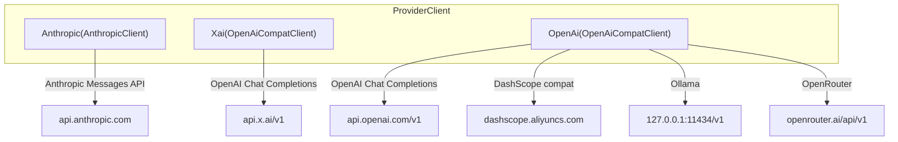

# Claw Code API 參考文件

---

## 1. 多提供商架構

Claw Code 透過 `ProviderClient` enum 統一封裝三種 AI API：



---

## 2. 提供商偵測邏輯

```rust
// api/src/providers/mod.rs
pub fn detect_provider_kind(model: &str) -> ProviderKind {
    // 1. claude-* → Anthropic
    // 2. grok-* → Xai
    // 3. qwen-*, qwen/* → OpenAi (DashScope)
    // 4. openai/*, gpt-* → OpenAi
    // 5. 其他 → 依據環境變數選擇
}
```

### 環境變數優先序
| 優先級 | 環境變數 | 提供商 |
|--------|----------|--------|
| 1 | `ANTHROPIC_API_KEY` / `ANTHROPIC_AUTH_TOKEN` | Anthropic |
| 2 | `OPENAI_API_KEY` | OpenAI |
| 3 | `XAI_API_KEY` | xAI |
| 4 | `DASHSCOPE_API_KEY` | DashScope |
| 預設 | 無 | Anthropic |

---

## 3. 請求格式（`MessageRequest`）

```rust
// api/src/types.rs
pub struct MessageRequest {
    pub model: String,           // 模型名稱
    pub max_tokens: u32,         // 最大輸出 token
    pub messages: Vec<InputMessage>, // 對話歷史
    pub system: Option<String>,  // 系統提示詞
    pub tools: Option<Vec<ToolDefinition>>,  // 工具定義
    pub tool_choice: Option<ToolChoice>,     // 工具選擇策略
    pub stream: bool,            // 啟用串流
    pub temperature: Option<f64>,
    pub top_p: Option<f64>,
    pub frequency_penalty: Option<f64>,
    pub presence_penalty: Option<f64>,
    pub stop: Option<Vec<String>>,
    pub reasoning_effort: Option<String>,  // "low"|"medium"|"high"
}
```

### 訊息格式

```rust
pub struct InputMessage {
    pub role: String,  // "user" | "assistant"
    pub content: Vec<InputContentBlock>,
}

pub enum InputContentBlock {
    Text { text: String },
    ToolUse { id: String, name: String, input: Value },
    ToolResult { tool_use_id: String, content: Vec<ToolResultContentBlock>, is_error: bool },
}
```

### 工具定義

```rust
pub struct ToolDefinition {
    pub name: String,                // 工具名稱
    pub description: Option<String>, // 工具描述
    pub input_schema: Value,         // JSON Schema
}

pub enum ToolChoice {
    Auto,              // 模型自行決定
    Any,               // 必須使用任一工具
    Tool { name: String }, // 指定工具
}
```

---

## 4. 回應格式（`MessageResponse`）

```rust
pub struct MessageResponse {
    pub id: String,          // 訊息 ID
    pub kind: String,        // "message"
    pub role: String,        // "assistant"
    pub content: Vec<OutputContentBlock>,
    pub model: String,       // 實際使用的模型
    pub stop_reason: Option<String>,  // "end_turn" | "tool_use"
    pub usage: Usage,
    pub request_id: Option<String>,
}

pub enum OutputContentBlock {
    Text { text: String },
    ToolUse { id: String, name: String, input: Value },
    Thinking { thinking: String, signature: Option<String> },
    RedactedThinking { data: Value },
}
```

---

## 5. SSE 串流事件

Anthropic 使用自訂 SSE 格式，事件序列：

```
event: message_start      → MessageStartEvent
event: content_block_start → ContentBlockStartEvent
event: content_block_delta → ContentBlockDeltaEvent (TextDelta | InputJsonDelta | ThinkingDelta)
event: content_block_stop  → ContentBlockStopEvent
event: message_delta       → MessageDeltaEvent (stop_reason + usage)
event: message_stop        → MessageStopEvent
```

```rust
pub enum StreamEvent {
    MessageStart(MessageStartEvent),
    MessageDelta(MessageDeltaEvent),
    ContentBlockStart(ContentBlockStartEvent),
    ContentBlockDelta(ContentBlockDeltaEvent),
    ContentBlockStop(ContentBlockStopEvent),
    MessageStop(MessageStopEvent),
}

pub enum ContentBlockDelta {
    TextDelta { text: String },
    InputJsonDelta { partial_json: String },
    ThinkingDelta { thinking: String },
    SignatureDelta { signature: String },
}
```

---

## 6. Token 用量與成本

```rust
pub struct Usage {
    pub input_tokens: u32,
    pub output_tokens: u32,
    pub cache_creation_input_tokens: u32,
    pub cache_read_input_tokens: u32,
}

pub struct ModelPricing {
    pub input_cost_per_million: f64,
    pub output_cost_per_million: f64,
    pub cache_creation_cost_per_million: f64,
    pub cache_read_cost_per_million: f64,
}
```

### 已知定價

| 模型 | Input ($/M) | Output ($/M) | Cache Create ($/M) | Cache Read ($/M) |
|------|------------|-------------|-------------------|-----------------|
| Claude Opus | 15.00 | 75.00 | 18.75 | 1.50 |
| Claude Sonnet | 3.00 | 15.00 | 3.75 | 0.30 |
| Claude Haiku | 0.25 | 1.25 | 0.30 | 0.03 |

---

## 7. 認證方式

### Anthropic API Key

```bash
export ANTHROPIC_API_KEY="sk-ant-..."
```
- Header: `x-api-key: sk-ant-...`

### OAuth Bearer Token

```bash
export ANTHROPIC_AUTH_TOKEN="token..."
```
- Header: `Authorization: Bearer token...`

### OpenAI 相容

```bash
export OPENAI_API_KEY="sk-..."
export OPENAI_BASE_URL="http://..."  # 選填
```
- Header: `Authorization: Bearer sk-...`

### xAI

```bash
export XAI_API_KEY="..."
```

### DashScope

```bash
export DASHSCOPE_API_KEY="sk-..."
```
- 自動路由到 `dashscope.aliyuncs.com/compatible-mode/v1`

---

## 8. HTTP 代理支援

```rust
pub struct ProxyConfig {
    pub proxy_url: Option<String>,     // 統一代理 URL
    pub http_proxy: Option<String>,    // HTTP 代理
    pub https_proxy: Option<String>,   // HTTPS 代理
    pub no_proxy: Option<String>,      // 排除清單
}
```

支援環境變數：`HTTP_PROXY`、`HTTPS_PROXY`、`NO_PROXY`（大小寫均可）

---

## 9. 提示詞快取（Anthropic 專屬）

```rust
pub struct PromptCache {
    pub enabled: bool,
    pub paths: PromptCachePaths,
}

pub struct PromptCacheStats {
    pub hits: u32,
    pub misses: u32,
    pub total_saved_tokens: u64,
}
```

快取機制利用 Anthropic 的 `prompt-caching-scope-2026-01-05` beta 功能，減少重複系統提示詞的 token 消耗。

---

## 10. 錯誤處理

```rust
pub enum ApiError {
    Http(reqwest::Error),
    Json(serde_json::Error),
    Authentication(String),    // 認證失敗
    RateLimit(String),         // 速率限制
    ServerError(String),       // 伺服器錯誤
    InvalidResponse(String),   // 回應格式錯誤
    Configuration(String),     // 設定錯誤
}
```

---

*本文件基於 claw-code 專案原始碼分析產生 — 2026-04-26*
