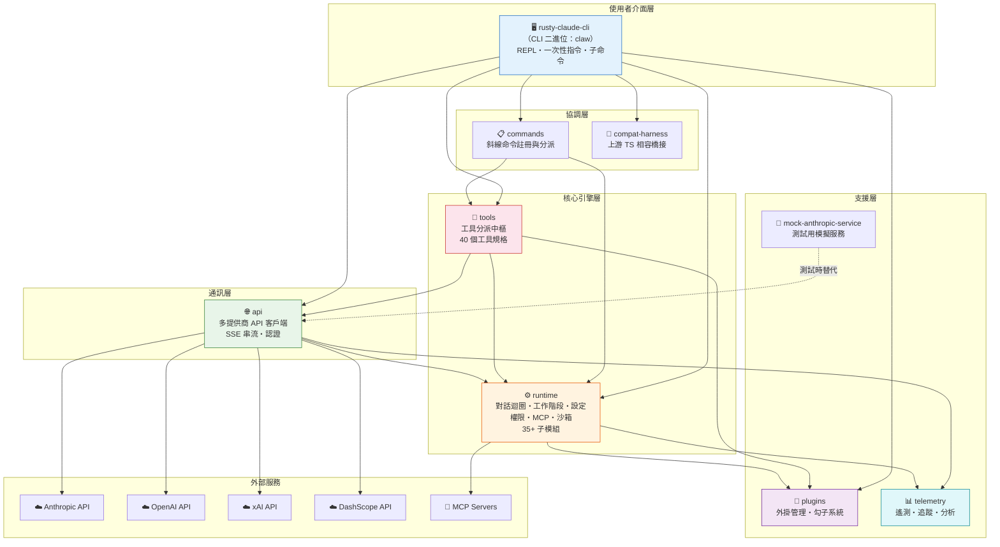
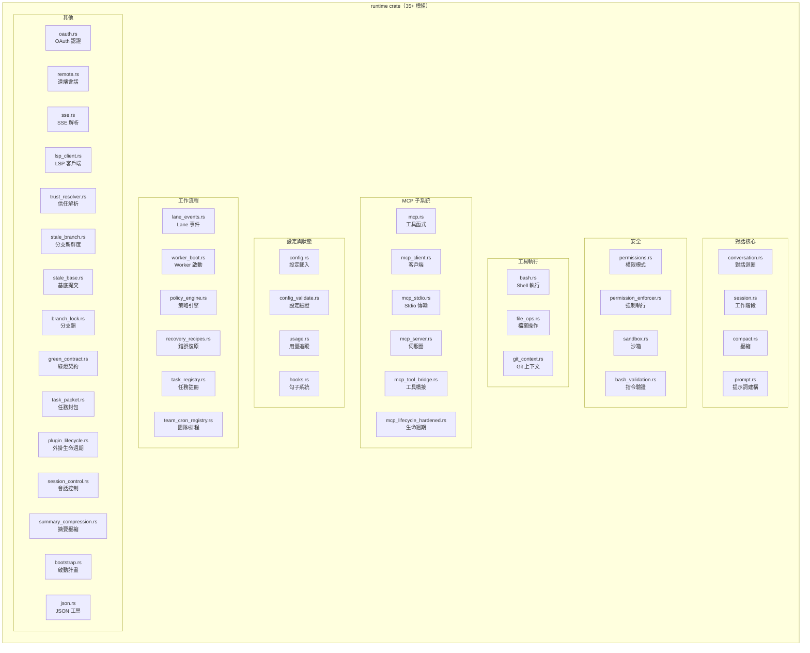
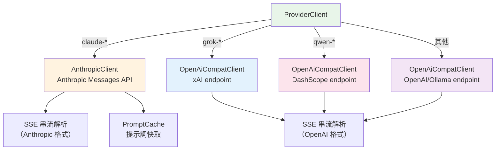
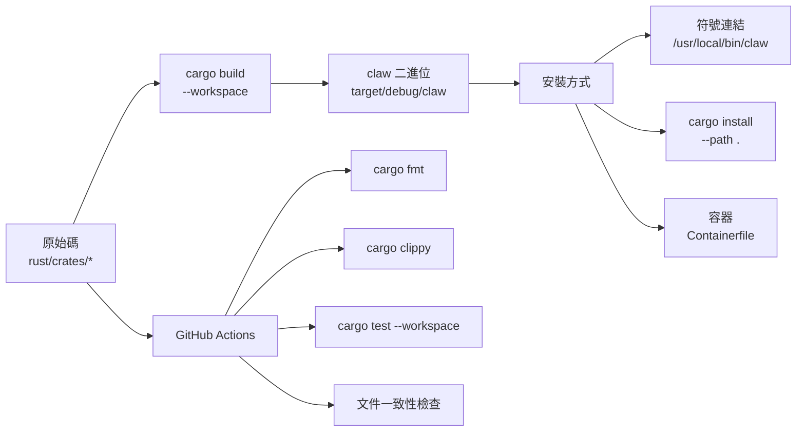

# Claw Code 系統架構深度解析

## 1. 高層架構總覽

Claw Code 採用**分層式 Cargo Workspace Monorepo** 架構，共 9 個 crate，嚴格遵循由上到下的依賴方向。



## 2. Crate 依賴矩陣

| Crate | 依賴 |
|-------|------|
| `rusty-claude-cli` | api, commands, compat-harness, runtime, plugins, tools |
| `tools` | api, runtime, plugins |
| `commands` | runtime, tools |
| `api` | runtime, telemetry |
| `runtime` | plugins, telemetry |
| `compat-harness` | commands, runtime, tools |
| `plugins` | (無內部依賴) |
| `telemetry` | (無內部依賴) |
| `mock-anthropic-service` | api (dev 依賴) |

## 3. 分層詳解

### 3.1 使用者介面層（`rusty-claude-cli`）

**職責**：所有使用者可見的互動面。

| 模組 | 檔案 | 職責 |
|------|------|------|
| 進入點 | `src/main.rs` | CLI 參數解析、模式判斷、工作階段管理 |
| REPL 輸入 | `src/input.rs` | rustyline 整合、Tab 補全、快捷鍵 |
| 終端渲染 | `src/render.rs` | Markdown → ANSI、語法高亮、Spinner 動畫 |
| 專案初始化 | `src/init.rs` | `claw init` 指令 |
| Build 腳本 | `build.rs` | 編譯時期元資料注入 |

**關鍵設計決策**：
- 使用 `crossterm` 跨平台終端控制
- `pulldown-cmark` + `syntect` 實現 Markdown 渲染 + 語法高亮
- `rustyline` 提供 GNU readline 相容的 REPL 體驗
- `ModelProvenance` 結構追蹤模型來源（flag → env → config → default）

### 3.2 核心引擎層（`runtime`）

**職責**：整個系統的「大腦」，包含 35+ 子模組。



### 3.3 工具層（`tools`）

**職責**：統一工具分派中樞，橋接 40 個工具到各自的執行器。

| 工具類別 | 工具名稱 | 執行器 |
|----------|----------|--------|
| 核心 I/O | `bash`, `read_file`, `write_file`, `edit_file` | runtime (bash.rs, file_ops.rs) |
| 搜尋 | `glob_search`, `grep_search` | runtime (file_ops.rs) |
| 網路 | `web_fetch`, `web_search` | tools (內建) |
| 工作流 | `task_*`, `team_*`, `cron_*` | runtime registries |
| MCP | `mcp__*__*` | runtime MCP bridge |
| LSP | `lsp` | runtime LSP registry |
| 外掛 | 動態載入 | plugins crate |
| 其他 | `agent`, `skill`, `todo_write`, `notebook_edit`, `sleep` 等 | 各自實作 |

### 3.4 通訊層（`api`）



## 4. 跨層互動模式

### 4.1 泛型 Runtime 模式

```rust
// runtime/src/conversation.rs
pub struct ConversationRuntime<C: ApiClient, T: ToolExecutor> { ... }
```

- `C: ApiClient` — 可注入真實客戶端或 mock
- `T: ToolExecutor` — 可注入真實工具或 mock
- 使得整個對話引擎可獨立測試

### 4.2 全域 Registry 模式

```rust
// tools/src/lib.rs — 使用 OnceLock 的懶初始化全域單例
fn global_task_registry() -> &'static TaskRegistry {
    static REGISTRY: OnceLock<TaskRegistry> = OnceLock::new();
    REGISTRY.get_or_init(TaskRegistry::new)
}
```

6 個全域 Registry：LSP、MCP、Task、Team、Cron、Worker。

### 4.3 設定合併鏈

```
優先級（低 → 高）：
~/.claw.json → ~/.config/claw/settings.json → <repo>/.claw.json → <repo>/.claw/settings.json → <repo>/.claw/settings.local.json
```

## 5. 建構與部署架構



## 6. 關鍵設計原則

1. **unsafe_code = "forbid"** — 整個工作區禁止 unsafe 程式碼
2. **clippy::pedantic** — 啟用最嚴格的 clippy 檢查
3. **Trait-based 多態** — 所有主要擴充點都用 trait 定義
4. **沙箱優先** — 預設啟用 Linux namespace 隔離
5. **多提供商不鎖定** — 模型名稱前綴路由，不綁定單一 AI 服務
6. **JSONL 持久化** — 工作階段使用追加寫入的 JSONL 格式，支援旋轉
7. **零外部資料庫** — 所有狀態以檔案系統管理

---

*本文件基於 claw-code 專案原始碼分析產生 — 2026-04-26*
