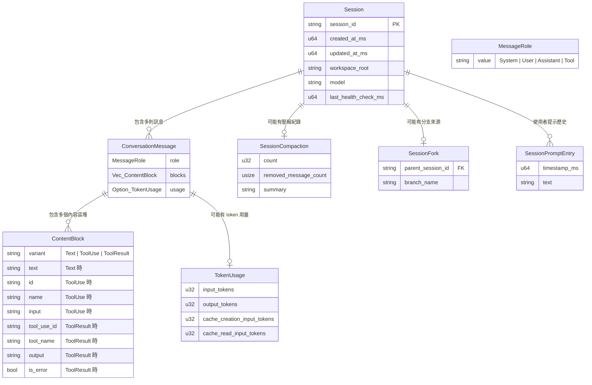
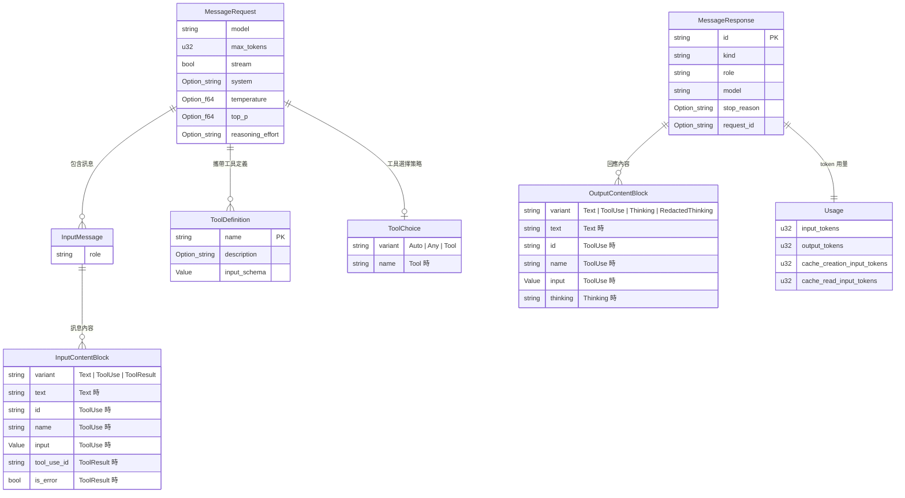
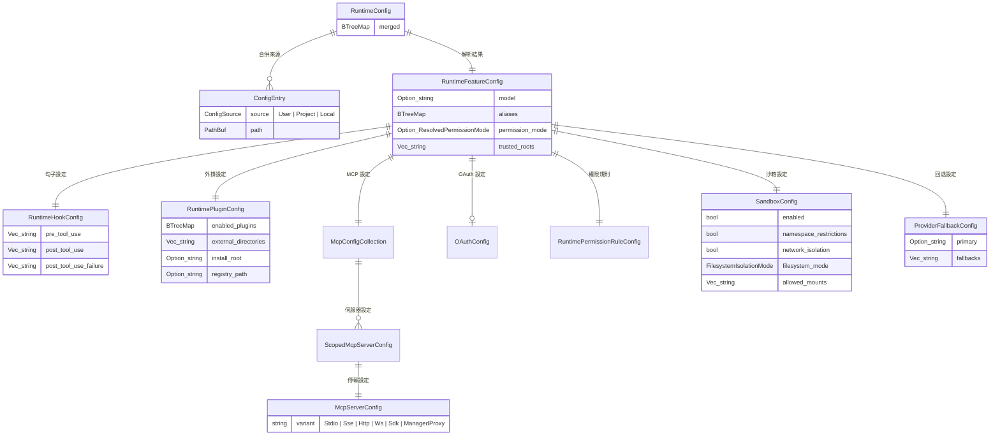
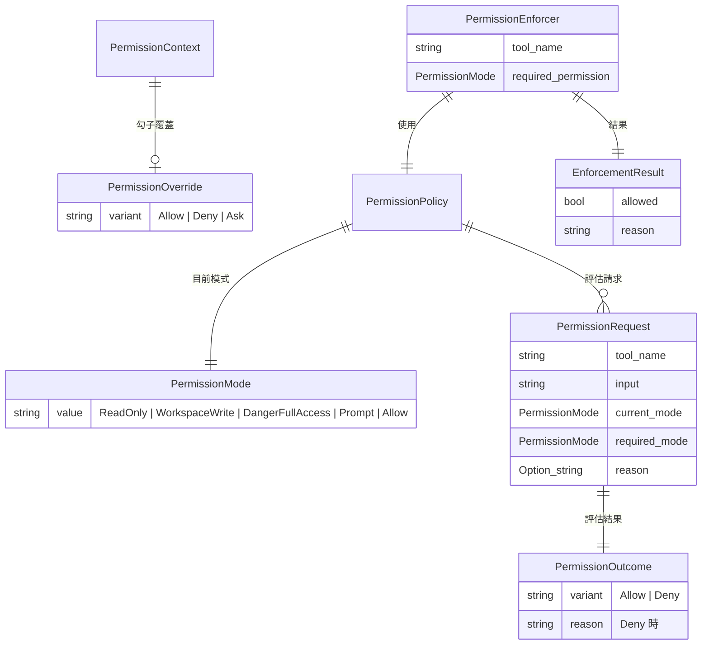
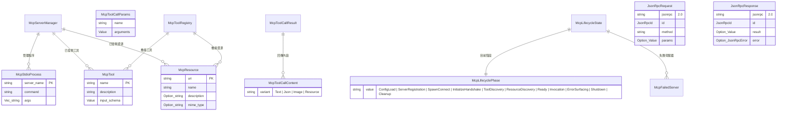
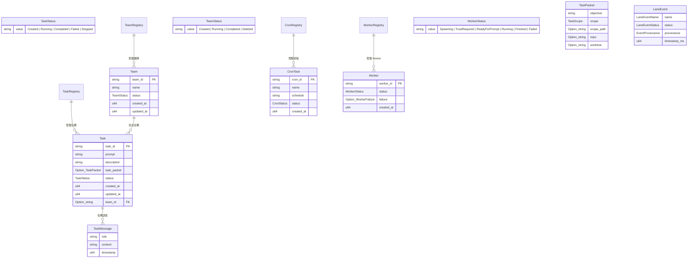
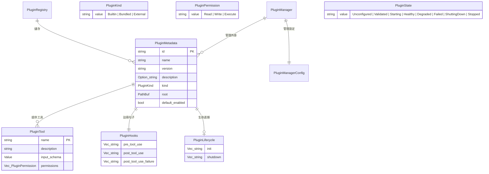
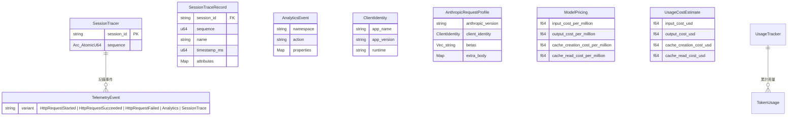

# Claw Code 資料模型與關聯圖

Claw Code **不使用傳統資料庫**，所有狀態以記憶體資料結構 + 檔案系統持久化管理。本文件以 Mermaid ER Diagram 呈現所有核心資料模型之間的關係。

---

## 1. 完整資料關聯圖

---

## 2. API 請求/回應資料模型

---

## 3. 設定資料模型

---

## 4. 權限系統資料模型

---

## 5. 工具系統資料模型

```mermaid
erDiagram
    ToolRegistry ||--o{ ToolManifestEntry : "工具清單"
    ToolManifestEntry {
        string name PK
        ToolSource source "Base | Conditional"
    }

    GlobalToolRegistry ||--o{ RuntimeToolDefinition : "執行時工具"
    GlobalToolRegistry ||--o{ PluginTool : "外掛工具"
    GlobalToolRegistry ||--|| PermissionEnforcer : "權限執行器"

    ToolSpec {
        string name PK
        string description
        Value input_schema
        PermissionMode required_permission
    }

    BashCommandInput {
        string command
        Option_u64 timeout
        Option_string description
        Option_bool run_in_background
        Option_bool dangerously_disable_sandbox
        Option_FilesystemIsolationMode filesystem_mode
    }

    BashCommandOutput {
        string stdout
        string stderr
        bool interrupted
        Option_string background_task_id
        Option_bool is_image
    }

    ReadFileOutput {
        TextFilePayload file
    }

    TextFilePayload {
        string file_path
        string content
        usize num_lines
        usize start_line
        usize total_lines
    }

    WriteFileOutput {
        string file_path
        string content
        Vec_StructuredPatchHunk structured_patch
    }

    GrepSearchInput {
        string pattern
        Option_string path
        Option_string glob_pattern
        Option_string output_mode
    }
```

---

## 6. MCP 系統資料模型

---

## 7. 工作流程資料模型

---

## 8. 外掛系統資料模型

---

## 9. 遙測系統資料模型

---

## 10. 持久化策略摘要

| 資料 | 格式 | 路徑 | 旋轉策略 |
|------|------|------|----------|
| 工作階段 | JSONL | `.claw/sessions/<id>.jsonl` | 256KB 旋轉，保留 3 份 |
| Worker 狀態 | JSON | `.claw/worker-state.json` | 覆蓋寫入 |
| 設定 | JSON | `.claw.json` / `.claw/settings.json` | 手動管理 |
| 遙測 | JSONL | 遙測路徑 | 追加寫入 |
| OAuth 憑證 | JSON | credentials 路徑 | 覆蓋寫入 |
| 任務/團隊/排程 | 記憶體 | 無持久化 | Session 結束時消失 |
| MCP 連線 | 記憶體 | 無持久化 | Session 結束時關閉 |
| LSP 連線 | 記憶體 | 無持久化 | Session 結束時關閉 |

---

*本文件基於 claw-code 專案原始碼分析產生 — 2026-04-26*
