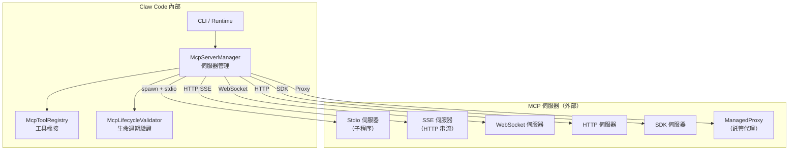
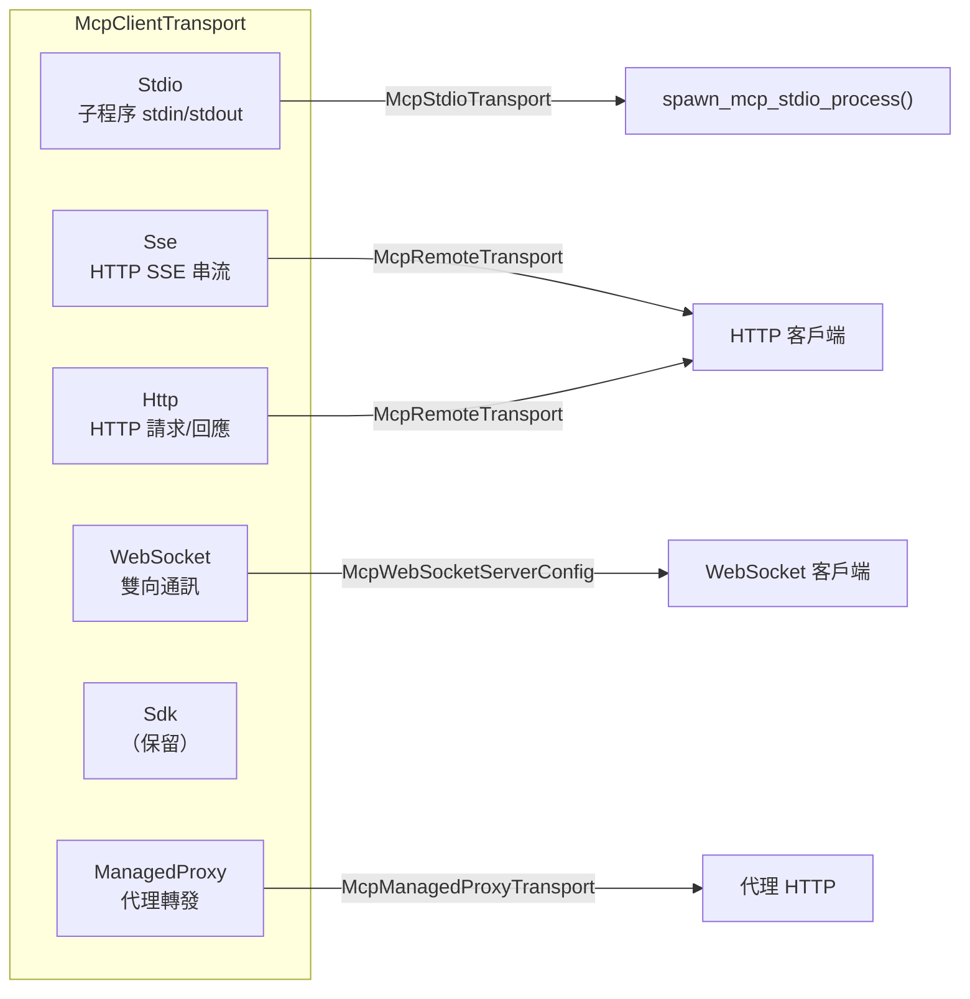
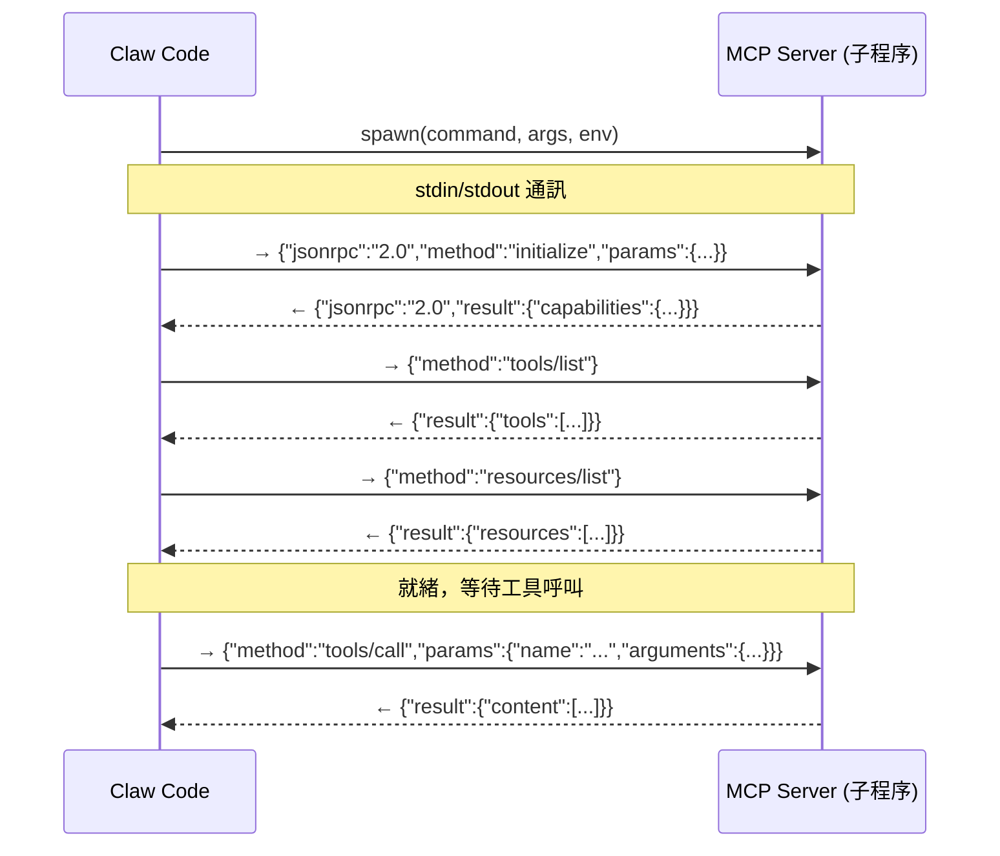
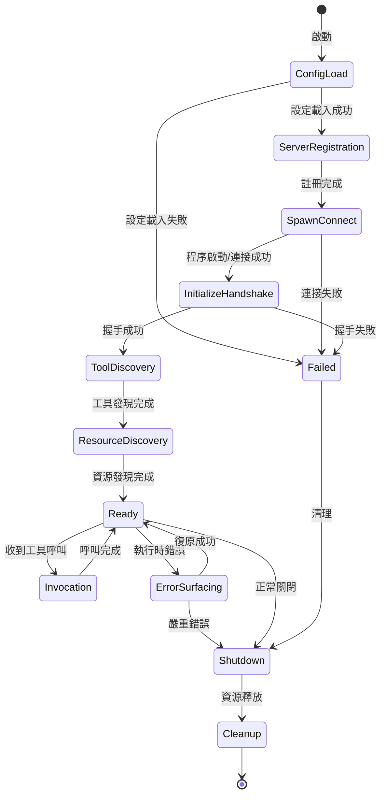
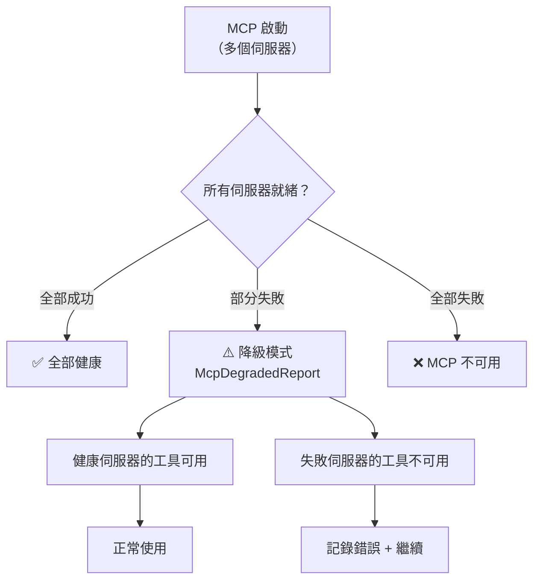

# Claw Code MCP（Model Context Protocol）架構

---

## 1. MCP 概覽

MCP（Model Context Protocol）是 Claw Code 中用於與外部工具伺服器通訊的協定子系統。它讓 AI 模型能夠存取外部服務提供的工具和資源。



---

## 2. 涉及的原始碼檔案

| 檔案 | 角色 |
|------|------|
| `runtime/src/mcp.rs` | MCP 命名工具函式（前綴、簽章、雜湊） |
| `runtime/src/mcp_client.rs` | 傳輸層抽象（6 種傳輸方式） |
| `runtime/src/mcp_stdio.rs` | Stdio 傳輸實作（子程序、JSON-RPC） |
| `runtime/src/mcp_server.rs` | 本地 MCP 伺服器（Protocol v2024-11-05） |
| `runtime/src/mcp_tool_bridge.rs` | 伺服器 → 工具系統橋接 |
| `runtime/src/mcp_lifecycle_hardened.rs` | 11 階段生命週期狀態機 |

---

## 3. 傳輸層



### 3.1 Stdio 傳輸

最常用的傳輸方式。Claw Code 啟動一個子程序，透過 stdin/stdout 傳送 JSON-RPC 訊息。



### 3.2 設定範例

```json
{
  "mcpServers": {
    "my-server": {
      "type": "stdio",
      "command": "node",
      "args": ["server.js"],
      "env": { "PORT": "3000" },
      "tool_call_timeout_ms": 30000
    },
    "remote-server": {
      "type": "sse",
      "url": "https://api.example.com/mcp",
      "headers": { "Authorization": "Bearer token" }
    },
    "ws-server": {
      "type": "ws",
      "url": "wss://api.example.com/mcp/ws"
    }
  }
}
```

---

## 4. 生命週期狀態機



### 階段說明

| 階段 | 說明 |
|------|------|
| `ConfigLoad` | 從設定檔讀取 MCP 伺服器設定 |
| `ServerRegistration` | 將伺服器規格註冊到管理器 |
| `SpawnConnect` | 啟動子程序或建立遠端連線 |
| `InitializeHandshake` | 發送 `initialize` JSON-RPC 請求 |
| `ToolDiscovery` | 發送 `tools/list` 取得可用工具 |
| `ResourceDiscovery` | 發送 `resources/list` 取得可用資源 |
| `Ready` | 伺服器就緒，可接受工具呼叫 |
| `Invocation` | 正在執行工具呼叫 |
| `ErrorSurfacing` | 處理執行時錯誤 |
| `Shutdown` | 正在關閉 |
| `Cleanup` | 最終資源清理 |

---

## 5. 工具命名規範

MCP 工具在 Claw Code 中使用特定命名格式：

```
mcp__<server_name>__<tool_name>
```

例如：
- `mcp__github__search_repos`
- `mcp__database__query`

```rust
// runtime/src/mcp.rs
pub fn mcp_tool_prefix(server_name: &str) -> String {
    format!("mcp__{server_name}__")
}

pub fn mcp_tool_name(server_name: &str, tool_name: &str) -> String {
    format!("mcp__{server_name}__{tool_name}")
}
```

---

## 6. JSON-RPC 通訊協定

```rust
pub struct JsonRpcRequest {
    pub jsonrpc: String,     // "2.0"
    pub id: JsonRpcId,       // 請求 ID
    pub method: String,      // 方法名稱
    pub params: Option<Value>, // 參數
}

pub struct JsonRpcResponse {
    pub jsonrpc: String,
    pub id: JsonRpcId,
    pub result: Option<Value>,
    pub error: Option<JsonRpcError>,
}

pub struct JsonRpcError {
    pub code: i64,
    pub message: String,
    pub data: Option<Value>,
}
```

### 支援的 JSON-RPC 方法

| 方法 | 方向 | 說明 |
|------|------|------|
| `initialize` | Client → Server | 初始化握手 |
| `tools/list` | Client → Server | 列出可用工具 |
| `tools/call` | Client → Server | 執行工具 |
| `resources/list` | Client → Server | 列出可用資源 |
| `resources/read` | Client → Server | 讀取資源內容 |

---

## 7. 降級模式

當 MCP 伺服器部分失敗時，系統進入降級模式：

```rust
pub struct McpDegradedReport {
    pub healthy_servers: Vec<String>,   // 健康的伺服器
    pub failed_servers: Vec<McpFailedServer>, // 失敗的伺服器
}

pub struct McpFailedServer {
    pub server_name: String,
    pub phase: McpLifecyclePhase,  // 失敗的階段
    pub error: String,
}
```



---

## 8. 錯誤分類

```rust
pub enum McpErrorSurface {
    ConfigParse,        // 設定解析錯誤
    SpawnFailure,       // 程序啟動失敗
    ConnectionRefused,  // 連線被拒
    HandshakeTimeout,   // 握手逾時
    ToolDiscoveryEmpty, // 無工具發現
    InvocationError,    // 呼叫執行錯誤
    TransportError,     // 傳輸層錯誤
}
```

---

*本文件基於 claw-code 專案原始碼分析產生 — 2026-04-26*
