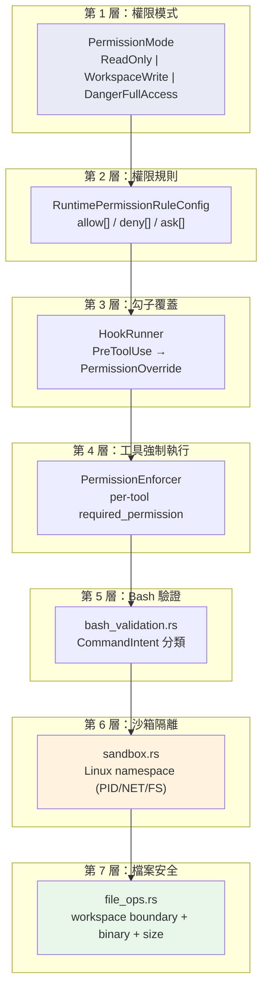
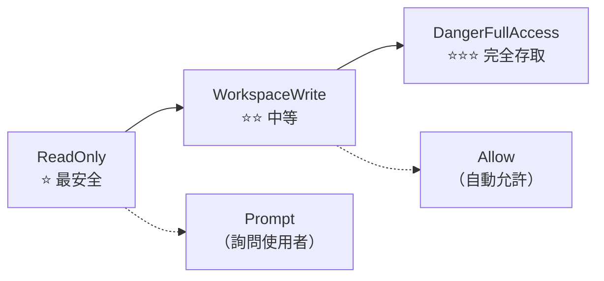
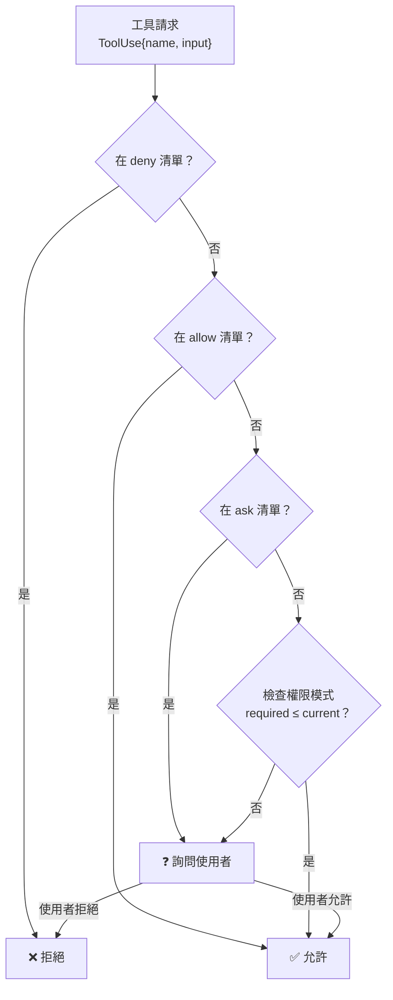
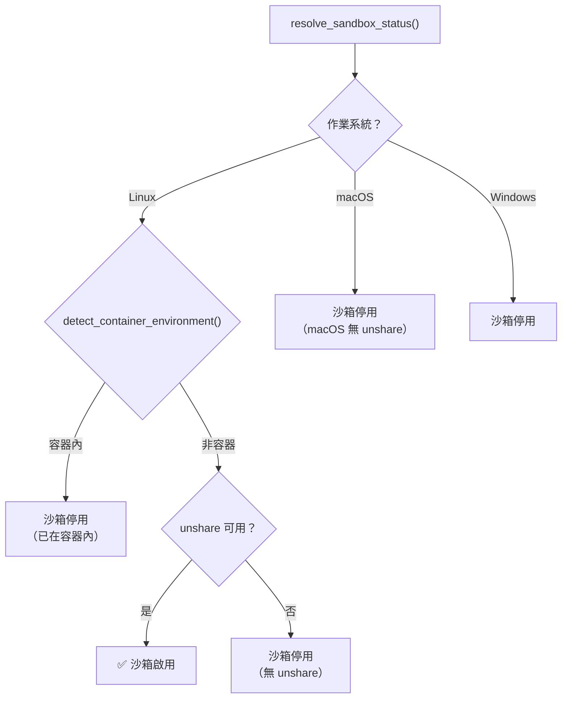
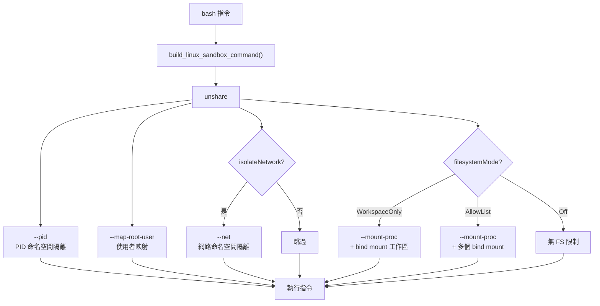
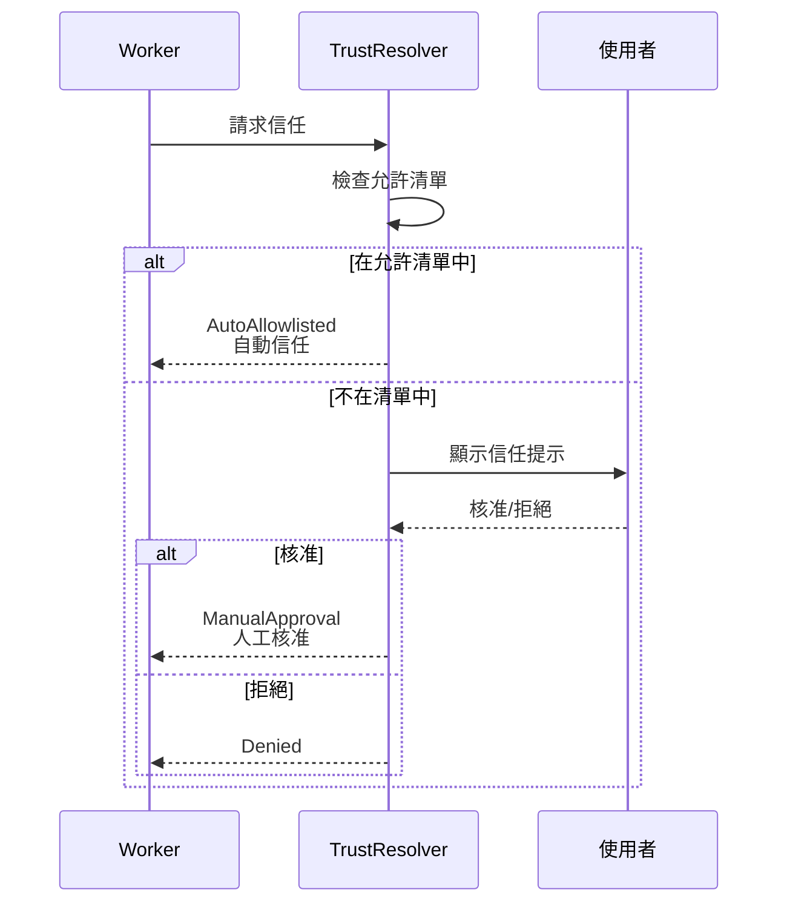

# Claw Code 安全模型

---

## 1. 安全架構總覽

Claw Code 實作了**多層防禦**的安全模型，從權限模式、工具級強制執行、到 Linux 沙箱隔離，確保 AI 模型的操作在使用者控制之下。



---

## 2. 權限模式（Permission Mode）



| 模式 | 說明 | 允許的工具操作 |
|------|------|---------------|
| `ReadOnly` | 唯讀模式 | 讀檔、搜尋、Web 查詢 |
| `WorkspaceWrite` | 工作區寫入 | + 寫檔、編輯、Bash |
| `DangerFullAccess` | 完全存取（**預設**） | + 所有操作 |
| `Prompt` | 每次詢問 | 每次操作都詢問使用者 |
| `Allow` | 自動允許 | 不做檢查 |

### CLI 使用方式
```bash
claw --permission-mode read-only prompt "..."
claw --permission-mode workspace-write prompt "..."
claw --dangerously-skip-permissions prompt "..."
```

---

## 3. 權限規則設定

在 `.claw.json` 或 `.claw/settings.json` 中設定：

```json
{
  "permissions": {
    "allow": ["read_file", "glob_search"],
    "deny": ["bash"],
    "ask": ["write_file", "edit_file"]
  }
}
```

### 評估流程



---

## 4. 勾子安全覆蓋

```rust
// runtime/src/hooks.rs
pub enum HookEvent {
    PreToolUse,           // 工具執行前
    PostToolUse,          // 工具執行後
    PostToolUseFailure,   // 工具執行失敗後
}
```

`pre_tool_use` 勾子可以回傳 `PermissionOverride`：
- `Allow` — 強制允許（跳過後續檢查）
- `Deny` — 強制拒絕
- `Ask` — 要求詢問使用者

---

## 5. 沙箱隔離

### 5.1 偵測流程



### 5.2 沙箱設定

```rust
pub struct SandboxConfig {
    pub enabled: bool,
    pub namespace_restrictions: bool,  // 啟用命名空間
    pub network_isolation: bool,       // 網路隔離
    pub filesystem_mode: FilesystemIsolationMode,
    pub allowed_mounts: Vec<String>,   // 允許的掛載點
}

pub enum FilesystemIsolationMode {
    Off,              // 無檔案系統限制
    WorkspaceOnly,    // 僅工作區目錄
    AllowList,        // 依允許清單
}
```

### 5.3 Linux 命名空間隔離



---

## 6. Bash 指令驗證

### 6.1 指令意圖分類

```rust
pub enum CommandIntent {
    ReadOnly,            // cat, ls, grep, find, head, tail ...
    Write,               // mv, cp, mkdir, touch, tee ...
    Destructive,         // rm -rf, dd, mkfs, fdisk ...
    Network,             // curl, wget, ssh, nc ...
    ProcessManagement,   // kill, pkill, killall ...
    PackageManagement,   // apt, npm, pip, cargo install ...
    SystemAdmin,         // systemctl, mount, chmod, chown ...
    Unknown,
}
```

### 6.2 驗證層

| 驗證 | 說明 | 在哪個模式下啟用 |
|------|------|-----------------|
| `validate_read_only_commands()` | 阻擋寫入指令 | ReadOnly |
| `validate_destructive_commands()` | 警告危險操作 | 所有模式 |
| `validate_mode_constraints()` | 強制權限邊界 | 所有模式 |
| `validate_sed_expressions()` | 檢查 sed 語法安全 | 所有模式 |
| `validate_path_patterns()` | 偵測可疑路徑 | 所有模式 |

### 6.3 已知指令清單

```rust
const WRITE_COMMANDS: &[&str] = &["mv", "cp", "mkdir", "touch", "tee", ...];
const DESTRUCTIVE_COMMANDS: &[&str] = &["rm", "dd", "mkfs", "fdisk", ...];
const NETWORK_COMMANDS: &[&str] = &["curl", "wget", "ssh", "nc", ...];
const STATE_MODIFYING_COMMANDS: &[&str] = &["git commit", "git push", ...];
```

---

## 7. 檔案操作安全

### 7.1 邊界檢查

```rust
fn validate_workspace_boundary(resolved: &Path, workspace_root: &Path) -> io::Result<()> {
    if !resolved.starts_with(workspace_root) {
        return Err(io::Error::new(
            io::ErrorKind::PermissionDenied,
            "path escapes workspace boundary",
        ));
    }
    Ok(())
}
```

### 7.2 安全限制

| 限制 | 值 | 用途 |
|------|-----|------|
| `MAX_READ_SIZE` | 10 MB | 防止讀取過大檔案 |
| `MAX_WRITE_SIZE` | 10 MB | 防止寫入過大檔案 |
| 二進位偵測 | NUL byte 檢查 | 避免損壞二進位檔 |
| 符號連結追蹤 | canonicalize() | 防止 symlink 逃逸 |
| 路徑遍歷 | `../` 偵測 | 防止目錄遍歷攻擊 |

---

## 8. 信任機制

### 8.1 Worker 信任閘門

```rust
pub enum TrustPolicy {
    AutoTrust,          // 自動信任（允許清單）
    RequireApproval,    // 需要人工核准
    Deny,               // 拒絕
}
```

### 8.2 信任流程



---

## 9. 安全最佳實踐建議

1. **開發階段**使用 `--permission-mode workspace-write`
2. **自動化腳本**使用 `--permission-mode read-only`
3. **不要**在共用機器上使用 `danger-full-access`
4. 善用 `.claw/settings.local.json` 中的 `deny` 清單
5. 啟用 `pre_tool_use` 勾子進行額外驗證
6. 定期審查 `.claw/sessions/` 中的工作階段紀錄
7. 在容器中執行以獲得額外隔離層

---

## 10. 安全相關環境變數

| 環境變數 | 說明 |
|----------|------|
| `ANTHROPIC_API_KEY` | API 金鑰（敏感資料） |
| `ANTHROPIC_AUTH_TOKEN` | OAuth token（敏感資料） |
| `CLAW_SANDBOX_ENABLED` | 強制啟用/停用沙箱 |
| `CLAW_PERMISSION_MODE` | 設定權限模式 |
| `NO_PROXY` | 代理排除清單 |

---

*本文件基於 claw-code 專案原始碼分析產生 — 2026-04-26*
