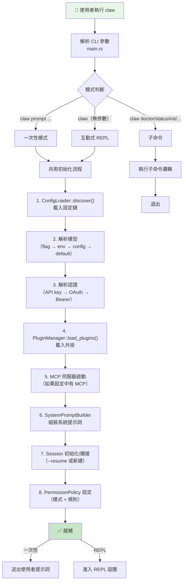
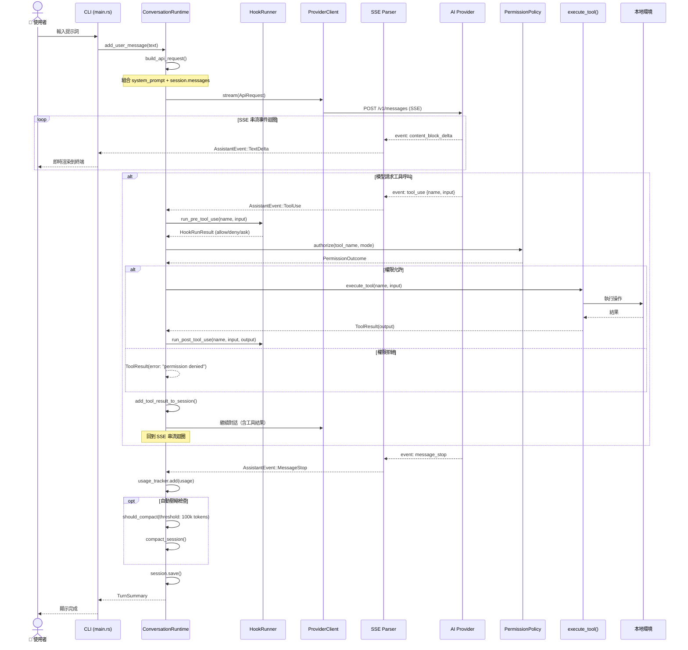
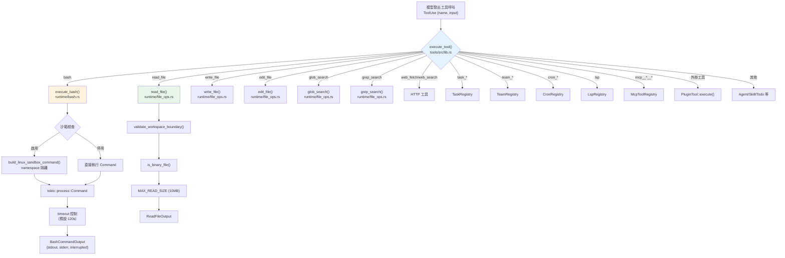
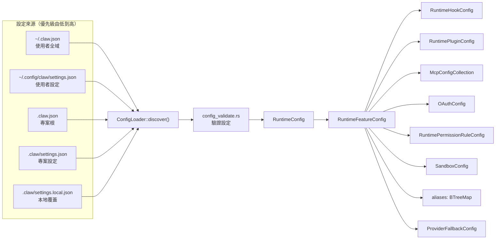
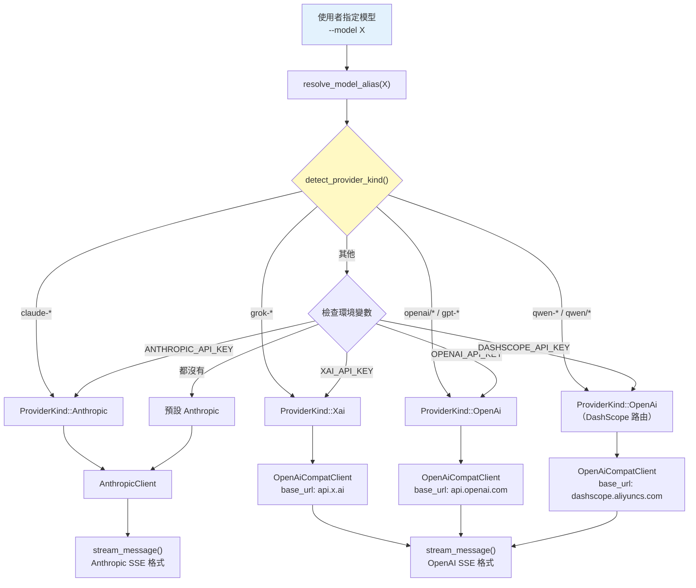
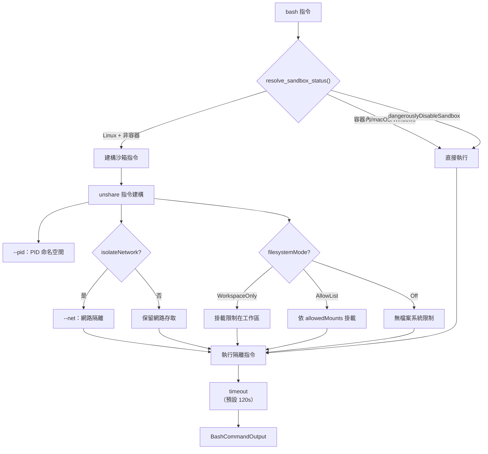
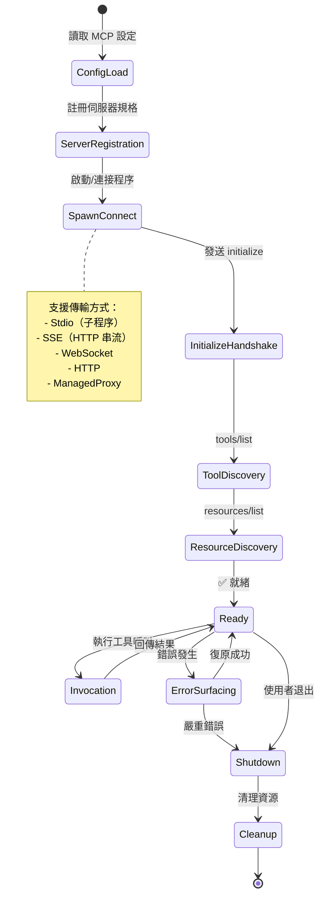
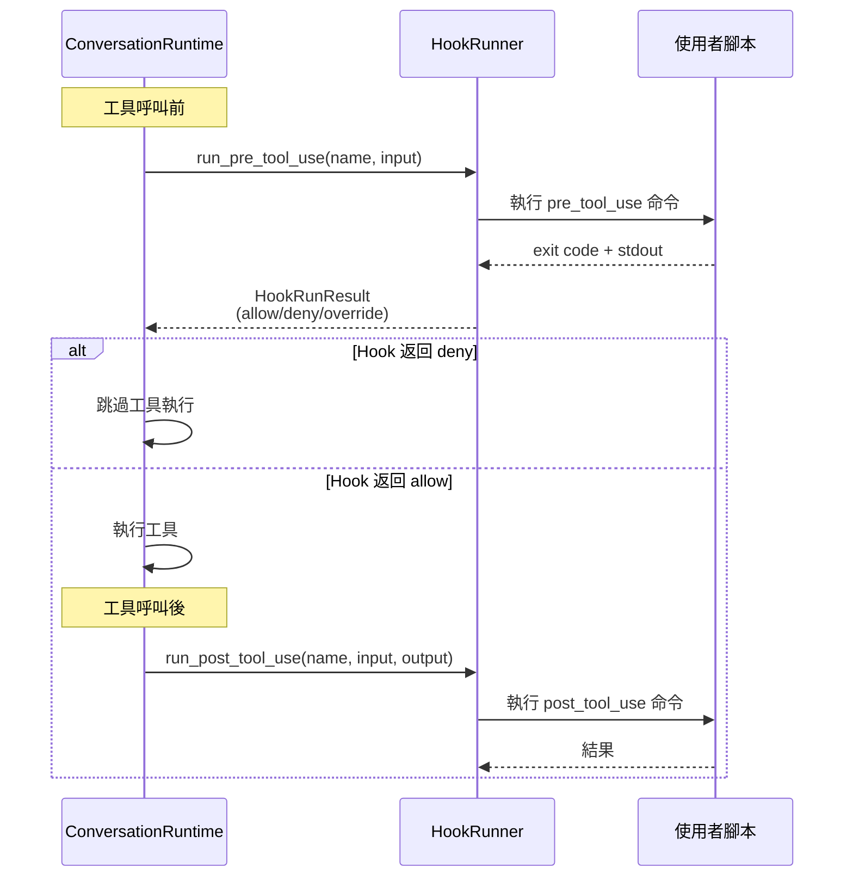
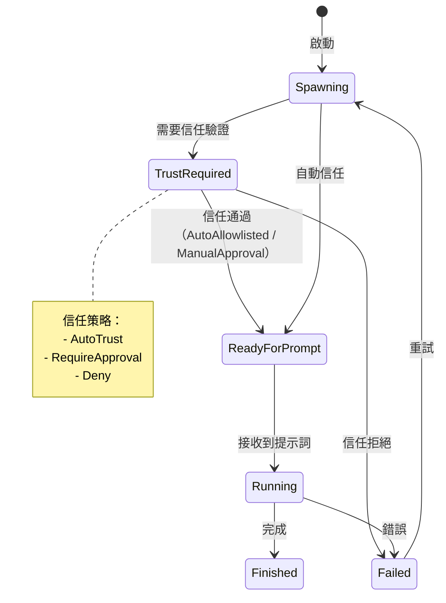
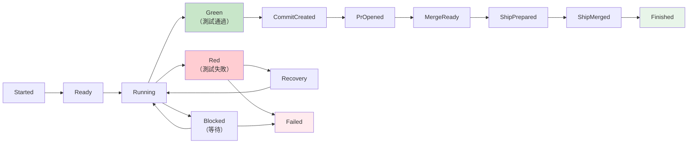

# Claw Code 系統流程圖

本文件以 Mermaid 圖表呈現 Claw Code 的所有關鍵系統流程。

---

## 1. 應用程式啟動流程



---

## 2. 對話迴圈（ConversationRuntime 核心）



---

## 3. 工具執行分派流程



---

## 4. 設定載入流程



---

## 5. 工作階段（Session）生命週期

```mermaid
stateDiagram-v2
    [*] --> Created: Session::new()
    Created --> Active: 第一則訊息
    Active --> Active: add_message()
    Active --> Compacted: compact_session()<br/>token 超過 100k
    Compacted --> Active: 繼續對話
    Active --> Saved: session.save()<br/>JSONL 持久化
    Saved --> Resumed: --resume latest
    Resumed --> Active: 載入歷史訊息

    Active --> Forked: fork()<br/>分支會話
    Forked --> Active: 在新分支繼續

    Saved --> Rotated: 超過 256KB
    Rotated --> Saved: 保留最新 3 個檔案

    Active --> [*]: 使用者退出
```

---

## 6. 提供商路由流程



---

## 7. 沙箱執行流程



---

## 8. MCP 伺服器生命週期



---

## 9. 勾子（Hook）執行流程



---

## 10. Worker 啟動狀態機



---

## 11. Lane 工作流程事件流



---

*本文件基於 claw-code 專案原始碼分析產生 — 2026-04-26*
