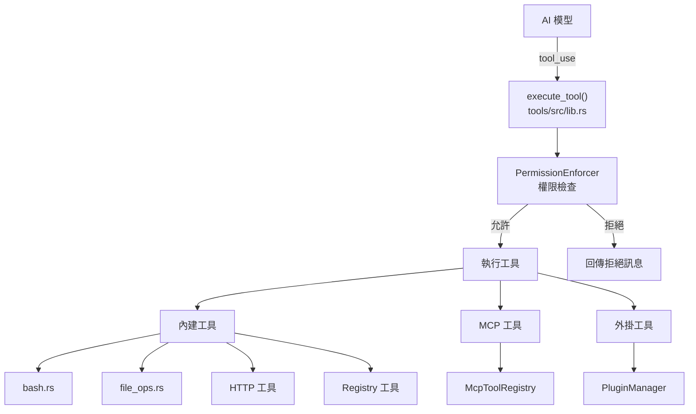
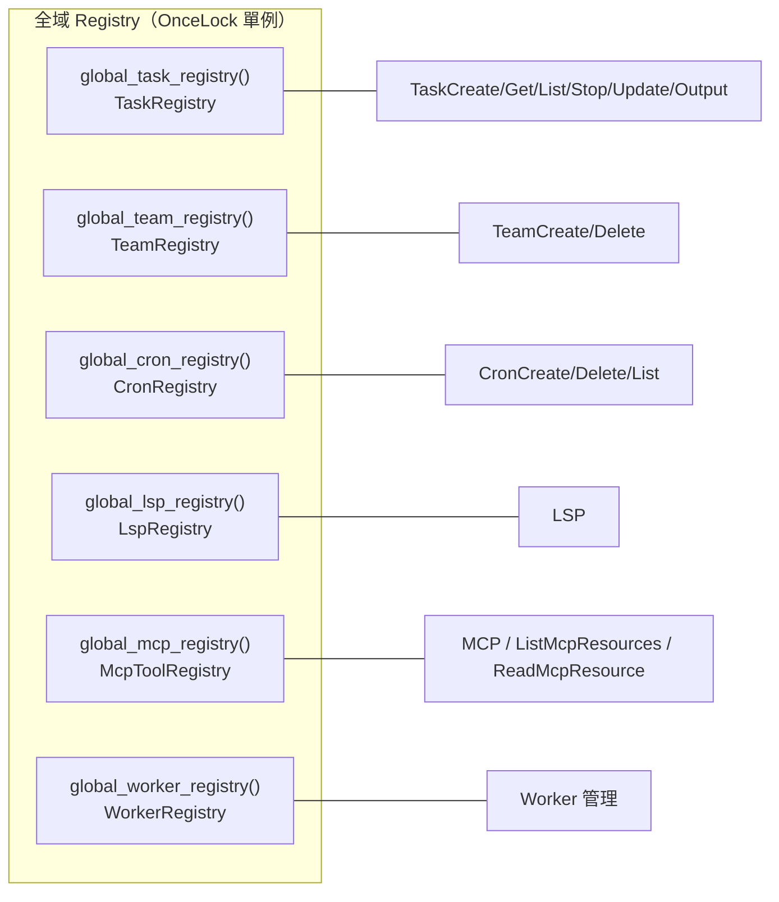
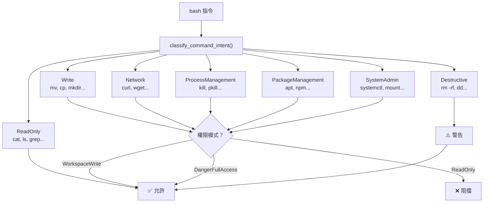

# Claw Code 工具系統參考

---

## 1. 工具系統架構



---

## 2. 全部 40 個內建工具規格

### 2.1 Shell 工具

#### `Bash`
- **權限**：`WorkspaceWrite`
- **輸入 Schema**：
  ```json
  {
    "command": "string (必填)",
    "timeout": "number (選填, 預設 120s)",
    "description": "string (選填)",
    "run_in_background": "boolean (選填)",
    "dangerouslyDisableSandbox": "boolean (選填)",
    "filesystemMode": "Off | WorkspaceOnly | AllowList (選填)",
    "isolateNetwork": "boolean (選填)",
    "allowedMounts": "string[] (選填)"
  }
  ```
- **輸出**：`{ stdout, stderr, interrupted, background_task_id, ... }`
- **安全機制**：沙箱隔離、Bash 指令驗證、權限模式強制執行

#### `PowerShell`
- **權限**：`WorkspaceWrite`
- **說明**：Windows PowerShell 執行（結構同 Bash）

#### `REPL`
- **權限**：`WorkspaceWrite`
- **說明**：互動式 REPL 環境

### 2.2 檔案工具

#### `ReadFile`
- **權限**：`ReadOnly`
- **輸入 Schema**：
  ```json
  {
    "file_path": "string (必填)",
    "offset": "number (選填, 起始行)",
    "limit": "number (選填, 讀取行數)"
  }
  ```
- **輸出**：`{ file: { file_path, content, num_lines, start_line, total_lines } }`
- **限制**：最大 10MB、二進位檔偵測、工作區邊界檢查

#### `WriteFile`
- **權限**：`WorkspaceWrite`
- **輸入 Schema**：
  ```json
  {
    "file_path": "string (必填)",
    "content": "string (必填)"
  }
  ```
- **輸出**：`{ file_path, content, structured_patch, git_diff }`
- **限制**：最大 10MB、工作區邊界、權限檢查

#### `EditFile`
- **權限**：`WorkspaceWrite`
- **輸入 Schema**：
  ```json
  {
    "file_path": "string (必填)",
    "old_string": "string (必填)",
    "new_string": "string (必填)",
    "replace_all": "boolean (選填)"
  }
  ```
- **輸出**：`{ file_path, old_string, new_string, structured_patch, git_diff }`

### 2.3 搜尋工具

#### `GlobSearch`
- **權限**：`ReadOnly`
- **輸入 Schema**：
  ```json
  {
    "pattern": "string (必填, glob 模式)",
    "path": "string (選填, 搜尋路徑)"
  }
  ```
- **輸出**：`{ duration_ms, num_files, filenames[], truncated }`

#### `GrepSearch`
- **權限**：`ReadOnly`
- **輸入 Schema**：
  ```json
  {
    "pattern": "string (必填, regex)",
    "path": "string (選填)",
    "glob": "string (選填, 檔案過濾)",
    "output_mode": "content | files_with_matches | count (選填)",
    "-B": "number (前文行數)",
    "-A": "number (後文行數)",
    "-C": "number (前後文行數)",
    "-n": "boolean (顯示行號)",
    "-i": "boolean (不區分大小寫)",
    "type": "string (檔案類型過濾)"
  }
  ```

#### `ToolSearch`
- **權限**：`ReadOnly`
- **說明**：搜尋可用工具

### 2.4 網路工具

#### `WebFetch`
- **權限**：`ReadOnly`
- **輸入**：`{ url, max_length, raw, start_index }`

#### `WebSearch`
- **權限**：`ReadOnly`
- **輸入**：`{ query, max_results }`

### 2.5 任務管理工具

| 工具 | 權限 | 說明 |
|------|------|------|
| `TaskCreate` | `WorkspaceWrite` | 建立新任務 |
| `TaskGet` | `ReadOnly` | 查詢任務 |
| `TaskList` | `ReadOnly` | 列出所有任務 |
| `TaskStop` | `WorkspaceWrite` | 停止任務 |
| `TaskUpdate` | `WorkspaceWrite` | 更新任務 |
| `TaskOutput` | `ReadOnly` | 取得任務輸出 |

### 2.6 團隊/排程工具

| 工具 | 權限 | 說明 |
|------|------|------|
| `TeamCreate` | `WorkspaceWrite` | 建立團隊 |
| `TeamDelete` | `WorkspaceWrite` | 刪除團隊 |
| `CronCreate` | `WorkspaceWrite` | 建立排程 |
| `CronDelete` | `WorkspaceWrite` | 刪除排程 |
| `CronList` | `ReadOnly` | 列出排程 |

### 2.7 MCP 工具

| 工具 | 權限 | 說明 |
|------|------|------|
| `ListMcpResources` | `ReadOnly` | 列出 MCP 資源 |
| `ReadMcpResource` | `ReadOnly` | 讀取 MCP 資源 |
| `McpAuth` | `WorkspaceWrite` | MCP 認證 |
| `MCP` | 視工具而定 | MCP 工具呼叫（格式：`mcp__<server>__<tool>`） |

### 2.8 LSP 工具

#### `LSP`
- **權限**：`ReadOnly`
- **動作**：`diagnostics`, `hover`, `definition`, `references`, `completion`, `symbols`, `format`
- **輸入**：`{ action, path, line, character, query }`

### 2.9 Agent 工具

| 工具 | 權限 | 說明 |
|------|------|------|
| `Agent` | `WorkspaceWrite` | 啟動子代理人 |
| `Skill` | `WorkspaceWrite` | 執行技能 |
| `Sleep` | `ReadOnly` | 等待指定時間 |

### 2.10 互動工具

| 工具 | 權限 | 說明 |
|------|------|------|
| `AskUserQuestion` | `ReadOnly` | 詢問使用者 |
| `SendUserMessage` | `ReadOnly` | 發送訊息給使用者 |

### 2.11 筆記工具

| 工具 | 權限 | 說明 |
|------|------|------|
| `TodoWrite` | `WorkspaceWrite` | 寫入待辦 |
| `NotebookEdit` | `WorkspaceWrite` | 編輯筆記 |

### 2.12 設定/模式工具

| 工具 | 權限 | 說明 |
|------|------|------|
| `Config` | `ReadOnly` | 讀取設定 |
| `StructuredOutput` | `ReadOnly` | 結構化輸出 |
| `EnterPlanMode` | `ReadOnly` | 進入規劃模式 |
| `ExitPlanMode` | `ReadOnly` | 離開規劃模式 |

### 2.13 其他

| 工具 | 權限 | 說明 |
|------|------|------|
| `RemoteTrigger` | `WorkspaceWrite` | 遠端觸發 |
| `TestingPermission` | - | 測試用 |

---

## 3. 全域 Registry 架構



---

## 4. Bash 指令驗證層



---

*本文件基於 claw-code 專案原始碼分析產生 — 2026-04-26*
